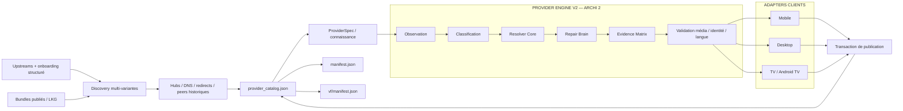

# Architecture NiakVIO — ARCHI 2

> **Document technique de référence à la racine du dépôt.** Toute évolution structurelle de NiakVIO doit mettre ce fichier à jour dans la même transaction que le code ou le workflow concerné.

Ce document décrit **l'architecture réellement attendue en production** : un seul catalogue provider, des ProviderBases propres et durables, un seul orchestrateur Quick/Deep, un Learning quotidien indépendant, un moteur de décision partagé et des preuves runtime séparées.

> NiakVIO n'héberge ni ne transcode les médias. Les providers/sites tiers restent les sources d'observation ; NiakVIO collecte leurs métadonnées, routes et structures publiques utiles, reconstruit ses ProviderBases propres, valide les résultats et publie des bundles Nuvio dérivés.

## 1. Invariant principal : une seule vérité

`provider_catalog.json` est la source de vérité publiée.

Il contient :

- l'identité canonique des providers ;
- la metadata Nuvio publiée ;
- l'appartenance aux projections général/VF ;
- l'ordre de publication ;
- les politiques de maintenance (`repairBeforeTriage`, LKG, quick/deep).

`manifest.json` et `vf/manifest.json` sont des **projections rendues depuis ce catalogue**.

Pendant la transition des anciennes primitives de promotion, `manifest.next.json` est uniquement une transaction candidate :

```text
promoter de compatibilité
        │
        ▼
manifest.next.json
        │
        ▼
import transactionnel
        │
        ▼
provider_catalog.json
        │
        ├── render → manifest.json
        └── render → vf/manifest.json
```

La transaction est rejetée si le round-trip catalogue → manifests n'est pas cohérent.

## 2. Vue d'ensemble



## 3. Orchestration : un seul pipeline

`.github/workflows/sync.yml` est le seul workflow autorisé à orchestrer la production complète :

```text
resolve mode
  → validate ARCHI2
  → hubs/domaines
  → discovery
  → catalog preservation gate
  → DNS migrations
  → runtime profiles / compat primitives
  → input deduplication / canonical provider selection
  → repair unresolved canonical providers
  → evidence gates
  → promotion
  → audit contenu/média
  → update canonical catalog
  → render manifests
  → hashes / integrity
  → atomic publish
```

Aucun autre workflow durable ne doit dupliquer cette boucle de publication.

## 4. Quick vs Deep

### Quick

Quick est une maintenance **réparatrice et publiable** :

1. recharge les hubs/domaines ;
2. redécouvre les sources et **rejette les doublons dès l'entrée du staging** ;
3. conserve le publié/LKG comme fallback d'état, pas comme sibling concurrent dans Repair ;
4. transmet exactement **un provider canonique** à Health/Repair ;
5. répare uniquement ce provider canonique lorsqu'il reste non résolu ;
6. accepte uniquement une amélioration sans régression runtime/identité ;
7. peut publier sans attendre Deep.

Un résultat inconclusif ne détruit pas le LKG.

### Deep

Deep utilise une profondeur/corpus plus large pour la **validation/repair déterministe du pipeline de publication**. Il couvre notamment :

- changements structurels importants ;
- preuve stricte de contenu ;
- reconstruction/probe plus profonde des providers déjà connus ;
- migrations de domaine difficiles lorsque Quick n'apporte pas une preuve suffisante.

**Deep n'est pas le Learning quotidien.** Le Learning est un workflow indépendant, avec son propre budget de temps et sa propre file persistante. Une simple mise à jour de Core, de provider ou de domaine ne doit donc pas relancer automatiquement le Learning ni un Lab natif lourd.

## 5. Discovery et provenance

NiakVIO collecte depuis plusieurs upstreams les **déclarations, métadonnées, capacités et indices de structure** nécessaires à la découverte. Ces upstreams sont des sources de connaissance/provenance, pas des seeds exécutables canoniques. Le dernier état publié/LKG reste un fallback de faible priorité.

La discovery :

- normalise l'identifiant canonique ;
- exclut torrent, magnet, Acestream et autres chemins P2P ;
- valide que l'artefact est bien JavaScript ;
- conserve source, repository, licence, manifest URL et SHA ;
- applique uniquement les transformations locales connues avant probe ;
- sélectionne une seule entrée par identifiant provider canonique avant Health/Repair ;
- rejette toute déclaration canonique dupliquée au staging au lieu de la repousser vers Repair.

La provenance finale reste inscrite dans `PROVENANCE.json`.
### 5.1 ProviderBase propre : connaissance durable, pas copie exécutable

Chaque provider possède un **ProviderBase NiakVIO** qui constitue sa logique durable. La règle de construction est stricte :

1. upstreams, hubs, pages publiques, APIs et observations runtime servent de **sources de connaissance** ;
2. NiakVIO extrait identité, capacités, langues, routes, paramètres, structure search/detail/player/API, contraintes de referer et formats ;
3. le ProviderBase est **reconstruit proprement par NiakVIO** ; du JavaScript exécutable tiers n'est pas réinjecté comme base canonique ;
4. une fois créé proprement, le ProviderBase est **réutilisé et enrichi** ; le Core ne repart pas d'un fichier externe et ne le reconstruit pas à chaque appel ;
5. le bundle public hashé est une **dérivation** du ProviderBase + état structuré courant + invariants Core.

Le contrat `NIAKVIO_PROVIDER_BASE_OWNED_V2` interdit le retour silencieux à une seed exécutable legacy. Le Learning peut enrichir routes et connaissances structurées, mais ne remplace pas un ProviderBase sain par du code tiers.

Pour les routes à jeton/signature, une route runtime apprise et précisément dérivée d'un player est consommée avant toute adaptation locale du player. La découverte de cette route appartient au Discovery/Learning, pas au runtime utilisateur.

### 5.2 Provider JS = lecteur spécialisé

Au runtime utilisateur, un provider JS est un **lecteur spécialisé**, jamais un moteur de découverte. Nuvio lui transmet l'identifiant TMDB, le type de transport et, pour les épisodes, saison/épisode. Le Core a déjà injecté le plan provider appris.

Le gate d'entrée commun est :

```text
TMDB ID + mediaType Nuvio
        ↓
movie reste movie ; series/show → tv
        ↓
si tv : classification TMDB canonique → tv ou anime
        ↓
comparaison avec les types sémantiques du provider
        ↓
incompatible / classification impossible → [] immédiatement
compatible → plan provider appris → adaptation → streams
```

Cette validation précède **tout appel au domaine du provider**. Ainsi un provider TV ne recherche jamais Mob Psycho si TMDB le classe anime, et un provider anime ne recherche jamais une série classique uniquement parce que Nuvio l'a transportée en `series/tv`.

Le runtime peut uniquement :

- instancier une route déjà apprise avec `id/slug/season/episode/type` ;
- suivre un redirect attendu ;
- récupérer une clé, signature ou token dynamique nécessaire à une route connue ;
- parser une page/player/API connus ;
- adapter headers, HLS/DASH et formats Nuvio ;
- refuser une identité ou un type incohérent.

Il ne peut pas essayer arbitrairement `/search?q`, `/search/`, plusieurs formes de fiches, explorer des dizaines de pages ou découvrir l'architecture d'un site. Une connaissance insuffisante doit produire un échec rapide et renvoyer le provider vers Discovery/Learning.

Pour limiter le coût du gate TMDB, le résultat est mis en cache dans le runtime provider ; les clients Nuvio utilisent en outre un client HTTP/cache partagé pour les requêtes addons, ce qui permet aux requêtes TMDB identiques d'être réutilisées lorsqu'elles sont cacheables.


## 6. Intelligence de domaine

L'identité d'un provider et son domaine courant sont **deux états différents**. Une URL fournie ou actuellement résolue n'est jamais gravée comme identité définitive du provider : elle reste un état terminal validé, remplaçable lorsque le site change de domaine.

La chaîne durable de résolution est :

```text
ProviderBase / identité provider
        ↓
Hub officiel / wiki
        ↓
URL terminale/directe connue
        ↓
Telegram public connu → dernier domaine exploitable
        ↓
Yandex → DuckDuckGo fallback
        ↓
découverte Telegram publique via recherche
        ↓
candidat direct de recherche le plus fiable
        ↓
historique / LKG
        ↓
validation même marque / allowlist
        ↓
DNS → HTTP/redirect → rôle terminal site/API
        ↓
official_site / official_api courants
```

Avant de conclure qu'un provider est cassé, le système distingue :

- hub officiel ;
- canal Telegram public d'adresse ;
- domaine terminal courant ;
- redirection ;
- ancien domaine ;
- peer historique encore valide ;
- candidat issu de recherche publique ;
- domaine détourné ou appartenant à une autre famille.

Une découverte provenant uniquement d'un moteur de recherche doit être confirmée sur **deux runs consécutifs**. Une découverte issue d'un hub, Telegram ou d'une source curatée peut être promue immédiatement après validation terminale. Une observation inconclusive conserve le **last-known-good** au lieu d'écraser la route.

Le changement `site.tld → nouveau-site.tld` peut donc modifier les couches de routage et reconstruire le bundle public dérivé, mais **ne remplace jamais la logique durable du ProviderBase**.

Une réponse HTTP seule ne suffit jamais pour promouvoir une adresse. Le domaine doit rester cohérent avec l'identité du provider et avec la route attendue.

Les snapshots upstream LKG permettent de continuer lorsque :

- un manifest amont devient temporairement inaccessible ;
- un manifest amont est corrompu/incomplet ;
- un fichier provider disparaît alors qu'un snapshot validé existe.

## 7. Contrat provider canonique

ARCHI 2 raisonne sur une requête interne :

```js
{
  tmdbId,
  mediaType: "movie" | "tv" | "anime",
  title,
  year,
  season,
  episode,
  languages,
  device,
  settings
}
```

Le core produit des candidats normalisés + preuves. Les adapters traduisent ensuite vers le contrat client réel.

Les branches spécifiques Desktop/Mobile/TV dans les providers sont un dernier recours : une différence ne doit exister que lorsqu'un runtime impose réellement une sémantique différente.

## 8. Resolver Core

La résolution est progressive et bornée :

```text
provider natif
  ↓
API / recherche / catalogue
  ↓
fiche exacte
  ↓
iframe / player / embed
  ↓
JavaScript / XHR / JSON
  ↓
playlist / média final
  ↓
contexte playback normalisé
```

Chaque étape produit des observations. Les limites incluent notamment :

- timeout ;
- nombre maximum de fetches ;
- pages/embeds ;
- hosts distincts ;
- redirects ;
- taille réponse et volume total ;
- domaines/chemins bloqués.

Le moteur ne doit jamais devenir un crawler ouvert non borné.

## 9. Repair Brain

`no_streams` est un symptôme, pas une cause racine.

Les classes V2 incluent :

- `not_invoked` ;
- `dns_unreachable` ;
- `transport_blocked` ;
- `search_gap` ;
- `identity_mismatch` ;
- `detail_gap` ;
- `episode_gap` ;
- `player_gap` ;
- `media_extraction_gap` ;
- `playback_context_gap` ;
- `media_validation_gap` ;
- `runtime_contract_drift` ;
- `healthy`.

Le Repair Brain du pipeline suit une boucle **déterministe et bornée**. Il ne lance pas le Learning quotidien et ne transforme pas un run Core en session d'apprentissage :

```text
classify
  → choose bounded strategy
  → generate candidate
  → probe
  → validate
  → compare to parent
  → accept or reject
```

Les recettes réussies sont versionnées et liées au contexte/runtime qui les prouve.
### 9.1 Learning quotidien indépendant et reprenable

Le workflow `brain-learning-lab.yml` est une boucle d'observation/apprentissage **indépendante du Core/Repair de publication**.

```text
observation santé du catalogue complet (enabled + disabled)
  → construction de la file adaptative
  → provider problématique suivant
  → résolution hub/direct/Telegram/recherche/LKG
  → repair/probes bornés
  → éventuellement Lab client ciblé sur un type déclaré
  → mémoire sanitizée
  → provider suivant
  → reprise inter-jours si le budget est épuisé
```

Règles opérationnelles :

- le catalogue complet est observé au moins une fois avant la file adaptative ;
- les providers `enabled:false` restent observables et réparables ;
- la file canonique est `scripts/run_brain_learning_queue.py` ;
- budget global courant : **60 minutes**, avec **5 minutes réservées** à la finalisation ;
- un provider peut connaître plusieurs tentatives utiles dans ce budget ;
- `pendingProviders`, `retryProviders`, `providerState` et le provider interrompu permettent la **reprise le jour suivant** ;
- un ciblage manuel `target_provider` utilise la même file canonique au lieu d'un chemin parallèle ;
- le cron quotidien est `17 2 * * *` (02:17 UTC ; 04:17 à Paris pendant l'heure d'été).

Le Learning produit de la connaissance et de la preuve ; il ne publie pas directement un provider sans repasser par les contrats de validation/publication prévus.


## 10. Déduplication avant Repair

Les variantes/source duplicates sont résolues **à l'entrée du staging**. Health et Repair ne reçoivent ensuite qu'un provider canonique par identifiant.

Repair ne sélectionne jamais un sibling et ne substitue jamais un autre provider pour masquer un échec. Il travaille sur le provider canonique reçu, compare uniquement le candidat réparé à son parent, puis accepte ou rejette selon les preuves.

Le publié/LKG reste disponible comme fallback de publication lorsque la nouvelle observation est inconclusive ou qu'aucune amélioration sûre n'est prouvée ; ce fallback n'est pas une seconde variante à parcourir dans la boucle de repair.

## 11. LKG et activation

Trois états doivent être distingués :

- **healthy/proven** : publication/activation possible ;
- **repairable/inconclusive** : réparation ou conservation du LKG ;
- **quarantine** : sortie dangereuse, mauvaise identité, provenance suspecte, domaine détourné ou autre preuve forte.

Un zéro résultat sur une fixture n'est pas une preuve suffisante d'incompatibilité globale.

Quick ne peut pas activer aveuglément un provider totalement nouveau. L'onboarding `add-provider.yml` peut construire et publier sa présence structurée, mais **l'activation reste false tant qu'une preuve runtime demandée n'est pas acquise**. Un hub valide, un HTTP 200 ou une API détectée ne suffisent pas à eux seuls à déclarer le provider jouable.

## 12. Validation média

Une URL trouvée ne compte jamais comme preuve.

Le système peut confirmer :

- HLS avec structure `#EXTM3U` ;
- DASH/MPD ;
- signature de conteneur ;
- playlist et/ou premier segment ;
- redirects compatibles.

Il rejette notamment :

- HTML/JSON déguisé ;
- page de player non résolue ;
- publicité/assets/démos ;
- previews anormalement courtes ;
- média illisible ;
- URL opaque non vérifiable lorsqu'aucune preuve payload n'existe.

## 13. Identité de l'œuvre

Un média jouable mais faux est plus dangereux qu'un `no_streams`.

La validation peut combiner :

- titre et alias ;
- année ;
- type ;
- saison/épisode ;
- chemin/nom du média ;
- metadata catalogue/player ;
- durée attendue/mesurée.

Une contradiction positive bloque la promotion.

`Unknown` ou `Inconnue` dans un label de qualité Nuvio ne constitue pas une contradiction d'identité.

## 14. Langue

La langue peut provenir de plusieurs preuves :

- metadata provider ;
- catalogue ;
- domaine ;
- player ;
- audio tracks ;
- subtitles ;
- observations connues de la source.

Une projection VF/VOSTFR doit rester cohérente avec la metadata canonique du provider. Seul le chemin relatif vers les bundles diffère naturellement entre le manifest racine et `vf/manifest.json`.

## 15. Contexte de playback

Les éléments nécessaires à la lecture peuvent être conservés lorsqu'ils ont été observés dans la même chaîne :

- `Referer` ;
- `Origin` ;
- `User-Agent` ;
- cookies scoped ;
- headers provider/player/média.

Ils ne doivent pas fuiter entre providers ou entre origines sans preuve.

## 16. Runtimes Nuvio

Les dépôts clients officiels servent de référence de comportement :

- Nuvio Mobile ;
- Nuvio Desktop ;
- NuvioTV.

Les versions/commits suivis sont décrits dans `automation/nuvio-client-upstreams.json` et les baselines V2.

Une preuve est **runtime-scoped** :

```text
même ProviderSpec
    ├── Mobile adapter  → preuve Mobile
    ├── Desktop adapter → preuve Desktop
    └── TV adapter      → preuve Android TV
```

Aucune réussite n'est transférée artificiellement d'un runtime à l'autre.

## 17. Evidence Matrix

L'état n'est pas un booléen global par provider. Il est indexé au minimum par :

```text
provider × œuvre × media type × langue × device × client contract version
```

Un provider peut être :

- prouvé sur movie mais non résolu sur TV ;
- fonctionnel Desktop mais cassé TV ;
- VF prouvé sur une source et VO seulement sur une autre ;
- sain sur une fixture et inconclusif sur une œuvre absente du catalogue.

Movie, TV/series et anime restent trois dimensions obligatoires. Breaking Bad S01E01 constitue une fixture TV de régression.

## 18. Largeur de catalogue

La cible opérationnelle reste **10 providers jouables par œuvre dont au moins 3 VF**.

C'est une cible de couverture, pas un relâchement des gates :

- mauvais contenu ;
- mauvais épisode ;
- durée contradictoire ;
- faux HLS ;
- média illisible ;
- identité non suffisamment prouvée

ne comptent pas comme succès.

## 19. Publication

Une transaction publiée contient au minimum :

- `provider_catalog.json` ;
- ProviderBases propres ;
- bundles providers adressés par contenu ;
- manifests rendus ;
- provenance ;
- overrides/domain history nécessaires ;
- LKG upstream/provider ;
- versions ;
- hashes.

Avant push :

1. promotion candidate ;
2. génération des projections ;
3. import dans le catalogue canonique ;
4. re-render des manifests ;
5. test de round-trip ;
6. audit contenu/média ;
7. release evidence fingerprint ;
8. génération hashes ;
9. intégrité finale ;
10. commit atomique.

Les bundles `providers/<id>--...--<hash>.js` sont des **artefacts clients immuables** : un fichier existant n'est pas réécrit sous le même hash.

La maintenance applique une **rétention glissante de 10 générations distinctes par provider** via `providers/.generation-retention.json`. Lorsqu'une 11e génération apparaît, seule la plus ancienne génération non protégée peut sortir de la fenêtre ; les références courantes/pending, le LKG et la provenance publiée restent protégés. Les sources non hashées ne sont pas supprimées par cette politique.

Le pipeline se termine par un checkout exact de `main` et rejoue les invariants de release.

## 20. Couche de compatibilité

La présence de fichiers historiques dans `scripts/` ne signifie pas qu'il existe deux moteurs.

Ils sont classés en primitives de compatibilité lorsque leur fonctionnalité est encore nécessaire, notamment :

- ingestion des anciens formats upstream ;
- application de certains overrides publiés ;
- wrappers runtime spécifiques déjà prouvés ;
- promotion des anciens bundles ;
- maintenance LKG ;
- probes historiques encore uniques.

Règle de migration :

```text
fonction utile historique
  → invariant V2 explicite
  → test V2
  → remplacement ou encapsulation
  → suppression de l'ancien doublon
```

Aucun nouveau comportement architectural ne doit être ajouté dans cette couche sans équivalent/invariant V2.

## 21. Workflows durables

`sync.yml` reste **l'unique pipeline de publication complète Quick/Deep**. Les autres workflows durables ont des responsabilités bornées et ne doivent pas recréer une seconde boucle de publication.

- **Publication / contrôle ARCHI 2** : `sync.yml`, `core-media-finalize-main.yml`, `provider-overrides-gate.yml` ;
- **preuves natives** : `native-mobile-android-reader.yml` (Android TV + Mobile Android), `native-mobile-ios-reader.yml`, `native-desktop-reader-acceptance.yml`, `native-corpus-device-targeted.yml`, `native-reader-learning-sync.yml` ;
- **onboarding provider** : `add-provider.yml`, qui matérialise une demande structurée, résout hub/direct/Telegram/recherche, génère ProviderBase + bundle, exécute les Labs bornés puis publie atomiquement seulement la transaction validée ;
- **Brain / connaissance / reporting** : `brain-learning-lab.yml`, `brain-branch-maintenance.yml`, `canonical-media-types.yml`, `provider-catalogue-breadth-lab.yml`, `provider-status-export.yml`, `provider-results-readme-sync.yml` ;
- **observabilité / découverte** : `availability.yml`, `domain-refresh.yml`, `weekly-upstream-provider-discovery.yml` ;
- **sécurité / qualité** : `github-actions-gate.yml`, `codeql.yml`, `security-final-gate.yml`, `repository-hygiene.yml`, `external-code-audit.yml`, `badge-light-contrast.yml` ;
- **maintenance GitHub Actions** : `purge-actions-history.yml` supprime automatiquement chaque semaine les runs terminés de plus de 7 jours ; le mode manuel permet une purge ponctuelle plus large.

Les Labs natifs conservent les snapshots AVD lorsque cela évite une reconstruction coûteuse, mais le cache Gradle est désactivé afin de limiter le quota de cache GitHub Actions. Les artifacts temporaires des Labs natifs sont conservés 1 jour.

Les branches Brain ne sont pas des branches de code alternatives : `brain-learning/proposals` est automatiquement reconstruite sur le dernier `main` en ne conservant que la mémoire sanitizée (`engine_v2/learning/latest.json` et `.md`). `brain-repair/proposal` n'existe que pendant une PR Brain ouverte ; après merge/fermeture elle est supprimée et le prochain proposal repart du `main` courant.

Le Learning Lab commence par une observation du **catalogue complet**, providers désactivés inclus, puis traite sa file adaptative pendant 60 minutes. La résolution provider peut utiliser hub connu, URL terminale, Telegram connu, Yandex/DuckDuckGo, découverte Telegram publique, candidat direct de recherche puis historique/LKG. Un domaine découvert uniquement par moteur de recherche doit être confirmé sur deux runs consécutifs avant de remplacer un last-known-good. Cette découverte n'active jamais automatiquement un provider désactivé.

Les workflows temporaires, one-shot et anciens orchestrateurs de refresh doivent disparaître après leur absorption dans les workflows durables.

## 22. Labs natifs sur `main`

Les Labs ne reposent pas sur des branches de code permanentes. Les preuves NuvioTV, Mobile Android, Mobile iOS et Desktop sont produites depuis le SHA exact de `main`, avec les dépôts clients officiels utilisés comme baselines en lecture seule après contrôle de drift. `native-mobile-android-reader.yml` porte aujourd'hui les preuves Android TV **et** Mobile Android avec isolation par job/runtime ; iOS et Desktop conservent leurs workflows dédiés. `native-corpus-device-targeted.yml` permet un corpus manuel ciblé TV, Mobile, Desktop ou tous les clients. Aucun Lab natif n'appelle le Learning pour réparer pendant sa propre exécution.

Une anomalie réelle devient une non-régression durable par la chaîne :

```text
bug réel
  → reproduction sur client officiel
  → observation
  → famille de cause
  → règle/recipe générique Core/Brain
  → validation
  → preuve runtime concernée
  → publication sur main
  → test permanent
```

`brain-learning/proposals` reste uniquement une mémoire sanitizée du Brain. Elle ne constitue ni un Lab de code ni une voie de publication, et les dépôts Nuvio officiels ne sont jamais modifiés par NiakVIO.

### Logos providers et capacités clients

Le catalogue publie une URL `scraper.logo` stable pour chaque provider à partir de `assets/providers/`. Les assets actuels sont des wordmarks WebP `72x32` et `96x40` ; ils sont valides comme images distantes mais les cartes Nuvio réservent un emplacement **carré** (TV : 32 dp, Mobile/Desktop : 28 dp) avec `ContentScale.Fit`. Une variante carrée serait donc une optimisation visuelle, pas une condition de fonctionnement.

La disponibilité du champ dans le manifest ne garantit pas son rendu. Aux références clients auditées en août 2026 :
- **NuvioTV** possède bien le rendu `AsyncImage(stream.addonLogo)`, mais son chemin plugin courant construit les streams avec `addonLogo = null` ;
- **NuvioMobile** et **NuvioDesktop** possèdent aussi le rendu de carte, mais leur conversion `PluginRuntimeResult -> StreamItem` ne propage pas actuellement `scraper.logo` ;
- les filtres/tabs providers des trois clients ne consomment que le nom texte du provider et n'acceptent pas de logo.

NiakVIO conserve donc les logos correctement dans ses manifests et ses fixtures, sans modifier les dépôts Nuvio. Les Labs peuvent signaler séparément si le logo est configuré et, en ciblage mono-provider, si l'asset distant est chargeable ; le rendu final reste une capacité du client.

## 23. Structure logique

```text
Niakvio/
├── provider_catalog.json            source de vérité
├── manifest.json                    projection générale
├── vf/manifest.json                 projection VF/VOSTFR
├── no-anime/manifest.json           projection générale sans providers anime
├── vf-no-anime/manifest.json        projection VF sans providers anime
├── provider-bases/                  logique durable NiakVIO reconstruite proprement
├── engine_v2/
│   ├── config/                      upstreams / adapters / evidence
│   ├── src/
│   │   ├── core/                    resolver / repair / decision / recipe
│   │   ├── runtime/                 adapters
│   │   └── provider-catalog.mjs     catalogue canonique
│   ├── scripts/                     ingestion / observation / génération
│   └── tests/                       invariants ARCHI 2
├── providers/                       artefacts clients hashés immuables (fenêtre glissante 10)
├── provider-hubs.json               hub/direct/Telegram/recherche et routes connues
├── provider-domain-history.json     historique/LKG de domaine
├── scripts/                         primitives de compatibilité nécessaires
├── automation/                      état/runtime/LKG/politiques
├── tests/                           non-régressions de release
├── .github/workflows/               production + preuves
├── PROVENANCE.json
├── FILE-HASHES.json
├── SHA256SUMS.json
└── PATCH-SHA256SUMS.txt
```

## 24. Invariants non négociables

1. Une seule source de vérité provider : `provider_catalog.json`.
2. Un seul orchestrateur de publication : `sync.yml`.
3. Réparer avant de trier/désactiver.
4. Health/Repair traite un seul provider canonique ; un sibling/upstream ne peut jamais masquer l'échec de ce provider.
5. Conserver le LKG sur preuve inconclusive.
6. Quarantine uniquement sur preuve forte.
7. Exploration et repair toujours bornés.
8. Une URL ne vaut pas preuve média.
9. Un média jouable avec mauvaise identité est un échec bloquant.
10. Aucun provider ne peut réussir grâce à la route ou au résultat d'un autre.
11. `Unknown/Inconnue` de présentation n'est pas une contradiction d'identité.
12. Les preuves Mobile Android/Mobile iOS/Desktop/TV sont indépendantes.
13. Quick peut réparer/publier sans attendre Deep.
14. Deep ne doit pas être relancé inutilement à chaque modification.
15. Les manifests sont rendus depuis le catalogue avant publication.
16. Toute publication est atomique, hashée et fail-closed.
17. Les Labs natifs valident le SHA exact de `main` ; aucune branche Lab de code permanente n'est requise.
18. Une primitive historique n'est conservée que tant qu'elle apporte une fonction réellement non remplacée.
19. Un ProviderBase propre est construit à partir de connaissance structurée ; le Core ne recopie ni ne réinjecte du code exécutable tiers comme base canonique.
20. Le ProviderBase durable n'est pas reconstruit à chaque appel ; le bundle public est dérivé et content-addressed.
21. Le Learning quotidien est indépendant du Core/Repair et reprend sa file entre les jours lorsque son budget est épuisé.
22. `series` / `show` sont des alias de transport de `tv` ; la sémantique canonique peut néanmoins devenir `anime` après résolution metadata.
23. Une route runtime signée précisément apprise est tentée avant le crawl générique d'embeds.
24. Les bundles hashés sont immuables et suivent une fenêtre de rétention de 10 générations, sans supprimer une génération encore référencée/protégée.