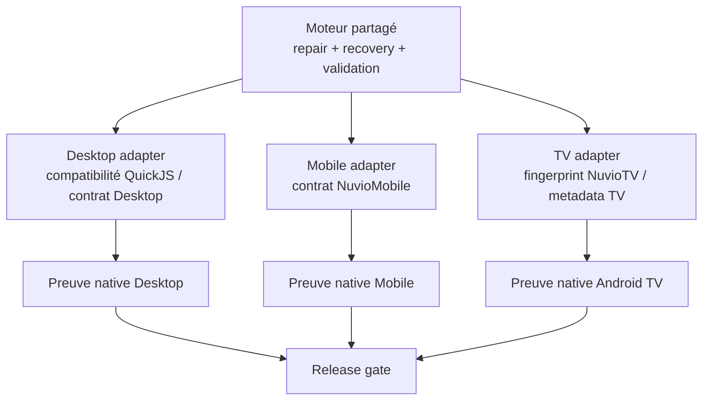

# Architecture NiakVIO

Ce document est la **référence d’architecture** du projet. Il décrit le système réellement présent dans le dépôt après la refonte : un moteur partagé, adaptatif et provider-agnostic qui observe les défaillances, choisit des stratégies de réparation réutilisables, génère des candidats, les valide puis ne promeut que les sorties prouvées.

> NiakVIO n’est pas un serveur vidéo, ne transcode pas les médias et n’héberge aucun flux. Les sites/providers tiers restent les sources. NiakVIO construit, répare, contrôle et publie les providers consommés par Nuvio.

## Vue d’ensemble

```mermaid
flowchart LR
    U[Providers upstream<br/>JS / manifests / hubs / domaines]
    D[Discovery & provenance<br/>variants • canonical source • LKG]
    N[Domain intelligence<br/>DNS • hubs • redirects • observed peers]

    subgraph B["CERVEAU PARTAGÉ NIAKVIO"]
      O[Observation runtime<br/>status • errors • HTTP • network • streams]
      C[Classification de panne<br/>no_streams • obsolete route • 403<br/>runtime error • invalid request • blocked media]
      S[Sélection de stratégie<br/>profils structurels + capabilities]
      R[Repair / Recovery borné<br/>API • catalogue • search • detail<br/>iframe/player • JS/XHR/JSON • media]
      X[Normalisation transport<br/>URL • HLS/DASH • headers • cookies<br/>Referer • Origin • User-Agent]
      V[Preuves strictes<br/>média • identité • saison/épisode<br/>durée • langue • provenance]
      G[Candidate gate<br/>statique + deep test + comparaison]

      O --> C --> S --> R --> X --> V --> G
      G -. échec / preuve insuffisante .-> O
    end

    P[Provider bundles immuables<br/>patches + hashes + provenance]
    M[Publication fail-closed<br/>manifest.json + vf/manifest.json]

    U --> D --> N --> O
    G -->|meilleur et prouvé| P --> M

    subgraph CLIENTS["PREUVES CLIENTS INDÉPENDANTES"]
      DESK[Nuvio Desktop]
      MOB[Nuvio Mobile]
      TV[NuvioTV / Android TV]
    end

    M --> DESK
    M --> MOB
    M --> TV

    subgraph LABS["LABS PERMANENTS"]
      LD[lab/desktop-mobile-real]
      LT[lab/tv-real]
      CORPUS[Corpus / multi-œuvres / catalogue]
    end

    DESK --> LABS
    MOB --> LABS
    TV --> LABS
    LABS -->|preuves réelles / nouvelles signatures| O
```



## Le « cerveau »

Le cœur n’est pas une collection de rustines par provider. Il fonctionne comme un **moteur décisionnel de réparation** :

1. il collecte des observations issues de l’exécution réelle du provider ;
2. il classe la famille de panne à partir de signatures reproductibles ;
3. il choisit un profil de réparation compatible avec la structure observée ;
4. il génère un nouveau candidat sans modifier aveuglément le provider publié ;
5. il valide l’artefact généré ;
6. il le deep-teste ;
7. il ne remplace le parent que si le candidat apporte une amélioration prouvée et respecte les gates de sécurité.

La couche `scripts/runtime_repair.py` est explicitement **provider-agnostic**. La couche `scripts/adaptive_runtime/runtime_repair.py` l’étend avec une récupération adaptative fondée sur les capabilities, domaines, origines observées et métadonnées disponibles, sans coder un provider particulier dans le moteur de décision.

## Familles de pannes comprises par le moteur

Le moteur sait notamment distinguer des classes telles que :

- provider sans origine exploitable malgré une infrastructure accessible ;
- recherche accessible mais routes historiques devenues obsolètes ;
- route provider obsolète (`404` / `410`) ;
- provider bloqué (`401` / `403`) ;
- média final bloqué alors que le provider retourne des streams ;
- erreur runtime après modification locale ;
- recherche/catalogue aboutissant sans flux ;
- flux retourné mais non vérifié en lecture ;
- provider inaccessible ou dégradé ;
- requête malformée / incompatibilité runtime.

Ces signatures doivent mener à des **stratégies réutilisables**, pas à la désactivation arbitraire d’un provider.

## Chaîne de récupération

Une réparation peut progresser de manière bornée à travers plusieurs niveaux :

```text
provider natif
  ↓
recherche / API / catalogue
  ↓
fiche exacte de l’œuvre
  ↓
iframe / player / embed
  ↓
JavaScript / XHR / JSON
  ↓
playlist / média final
  ↓
normalisation du contexte de lecture
```

La récupération adaptative possède des budgets (`max_pages`, `max_embeds`, timeout), des listes d’hôtes/chemins bloqués et des contrôles d’origine afin d’éviter une exploration non bornée.

## Intelligence domaine / provenance

Avant la récupération média, NiakVIO conserve la provenance des variantes et raisonne sur les domaines :

- domaine officiel ou terminal ;
- hub officiel ;
- redirection ;
- pair observé ;
- domaine historique/LKG encore vérifiable ;
- route ancienne ou contaminée par un autre provider.

Une réponse HTTP seule ne constitue jamais une preuve suffisante de validité.

## Gates de contenu et de lecture

Le cerveau ne considère pas « une URL trouvée » comme un succès.

### Intégrité média

Sont contrôlés notamment :

- HLS réel (`#EXTM3U`) et structure de playlist ;
- DASH/MPD ;
- conteneurs vidéo reconnus ;
- faux médias HTML/JSON ;
- assets, publicités, previews et vidéos anormalement courtes ;
- redirections et payloads incohérents.

### Identité de l’œuvre

Un média lisible mais correspondant à la mauvaise œuvre est un **échec bloquant**. La preuve peut combiner :

- titre et alias ;
- année ;
- type (`movie`, `tv`, `anime`) ;
- saison / épisode ;
- métadonnées découvertes ;
- durée attendue ou mesurée ;
- contradictions fortes issues du catalogue ou du média.

`Unknown` / `Inconnue` dans une qualité ou un label Nuvio n’est pas une preuve d’identité inconnue et ne doit pas rejeter un flux valide à lui seul.

### Langue

VF/VOSTFR est déterminée par combinaison de preuves lorsque disponibles : métadonnées provider, catalogue, domaine, player, pistes audio, sous-titres et observations réelles. Aucun indice isolé ne doit suffire à inventer une langue.

### Contexte de playback

Le flux final conserve, lorsqu’ils sont nécessaires :

- `Referer` ;
- `Origin` ;
- `User-Agent` ;
- cookies de session bornés et scoped au domaine/chemin.

Ce contexte est rafraîchi le long de la chaîne site → player → média et reste isolé entre sources.

## Adaptation aux runtimes

La règle est : **partagé par défaut, spécifique seulement quand le contrat client l’impose**.



Une preuve Desktop ne vaut pas preuve Mobile ou TV. La validation permanente exécute les runtimes officiels séparément. StreamZo peut servir de **provider sentinel** dans cette régression native ; ce n’est pas une technologie de l’architecture NiakVIO.

## Publication

La sortie validée comprend :

- bundles providers ;
- patches appliqués ;
- provenance ;
- versions ;
- hashes / sommes de contrôle ;
- règles d’activation ;
- `manifest.json` ;
- `vf/manifest.json`.

La publication est **fail-closed** : un candidat incomplet ou non prouvé ne doit pas écraser le dernier état connu comme sain.

## Labs permanents et boucle de feedback

Les Labs sont une partie structurelle du système :

- `lab/desktop-mobile-real` ;
- `lab/tv-real`.

Ils servent à reproduire les défauts dans les vrais clients, à élargir le corpus et à produire des preuves permettant au moteur partagé d’acquérir de **nouvelles règles explicites de diagnostic/réparation**. Il ne s’agit pas d’apprentissage automatique : l’évolution du « cerveau » reste déterministe, versionnée, testée et auditable.

Boucle de maintenance :

```text
bug réel
  → reproduction Lab
  → signature de panne
  → famille de cause
  → stratégie générique
  → candidat réparé
  → tests / identité / playback
  → Desktop + Mobile + TV si chemin partagé
  → publication
  → nouvelle non-régression permanente
```

## Structure logique du dépôt

```text
Niakvio/
├── providers/                       bundles publiés
├── scripts/
│   ├── runtime_repair.py            moteur de diagnostic/réparation générique
│   ├── adaptive_runtime/            extension adaptative provider-agnostic
│   ├── provider_patches/            stratégies/versioned repair profiles
│   ├── audit_*                      preuves contenu/catalogue/runtime
│   └── ...                          génération, validation, publication
├── automation/                      capabilities, upstreams, politiques, état
├── tests/                           non-régressions et safety gates
├── .github/workflows/               CI durable + Labs + preuve native
├── manifest.json                    projection générale
├── vf/manifest.json                 projection francophone
├── PROVENANCE.json                  provenance de release
├── FILE-HASHES.json                 intégrité des fichiers
├── SHA256SUMS.json                  intégrité de release
└── PATCH-SHA256SUMS.txt              intégrité des patches
```

## Invariants

1. Ne jamais promouvoir un stream sans preuve de contenu et de lecture suffisante.
2. Ne jamais considérer un mauvais contenu comme un succès parce qu’il joue correctement.
3. Préférer une règle générique à une rustine provider lorsque la cause est commune.
4. Conserver des budgets bornés, des patches idempotents et une provenance auditable.
5. Ne jamais faire passer un provider en utilisant la route d’un autre provider.
6. Ne jamais confondre `Unknown/Inconnue` de présentation avec une identité inconnue.
7. Ne jamais utiliser un test Desktop comme preuve TV.
8. Ne jamais supprimer les Labs permanents lors d’un nettoyage ordinaire.
9. Une publication ne doit pas dégrader silencieusement le dernier état sain.
10. Pour une modification d’un chemin de playback partagé, Desktop + Mobile + TV doivent être prouvés indépendamment avant validation finale.
