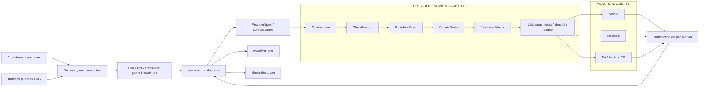

# Architecture NiakVIO — ARCHI 2

Ce document décrit **l'architecture réellement attendue en production** : un seul catalogue provider, un seul orchestrateur quick/deep, un moteur de décision partagé et des preuves runtime séparées.

> NiakVIO n'héberge ni ne transcode les médias. Les providers/sites tiers restent les sources ; NiakVIO collecte leurs implémentations publiques, construit des candidats, répare les structures cassées, valide les résultats et publie des bundles Nuvio.

## 1. Invariant principal : une seule vérité

`provider_catalog.json` est la source de vérité publiée.

Il contient :

- l'identité canonique des providers ;
- la metadata Nuvio publiée ;
- l'appartenance aux projections général/VF ;
- l'ordre de publication ;
- les politiques de maintenance (`repairBeforeTriage`, LKG, quick/deep).

`manifest.json` et `vf/manifest.json` sont des **projections rendues depuis ce catalogue**.

Pendant la transition des anciennes primitives de promotion, `manifest.next.json` est uniquement une transaction candidate :

```text
promoter de compatibilité
        │
        ▼
manifest.next.json
        │
        ▼
import transactionnel
        │
        ▼
provider_catalog.json
        │
        ├── render → manifest.json
        └── render → vf/manifest.json
```

La transaction est rejetée si le round-trip catalogue → manifests n'est pas cohérent.

## 2. Vue d'ensemble



## 3. Orchestration : un seul pipeline

`.github/workflows/sync.yml` est le seul workflow autorisé à orchestrer la production complète :

```text
resolve mode
  → validate ARCHI2
  → hubs/domaines
  → discovery
  → catalog preservation gate
  → DNS migrations
  → runtime profiles / compat primitives
  → healthy sibling selection
  → repair unresolved
  → evidence gates
  → promotion
  → audit contenu/média
  → update canonical catalog
  → render manifests
  → hashes / integrity
  → atomic publish
```

Aucun autre workflow durable ne doit dupliquer cette boucle de publication.

## 4. Quick vs Deep

### Quick

Quick est une maintenance **réparatrice et publiable** :

1. recharge les hubs/domaines ;
2. redécouvre toutes les variantes ;
3. garde les bundles publiés/LKG comme siblings de secours ;
4. préfère un sibling déjà sain ;
5. ne répare structurellement que les familles non résolues ;
6. accepte uniquement une amélioration sans régression runtime/identité ;
7. peut publier sans attendre Deep.

Un résultat inconclusif ne détruit pas le LKG.

### Deep

Deep utilise une profondeur/corpus plus large et reste l'autorité pour :

- nouvelles intégrations provider ;
- apprentissage/persistance de recipes ;
- changements structurels importants ;
- preuve stricte de contenu ;
- reconstruction globale de connaissance.

Deep est planifié séparément et déclenchable explicitement. Une simple mise à jour de code ou de domaine ne doit pas automatiquement provoquer un rebuild Deep complet.

## 5. Discovery et provenance

NiakVIO collecte les providers depuis plusieurs upstreams et ajoute le dernier état publié/LKG comme fallback de faible priorité.

La discovery :

- normalise l'identifiant canonique ;
- exclut torrent, magnet, Acestream et autres chemins P2P ;
- valide que l'artefact est bien JavaScript ;
- conserve source, repository, licence, manifest URL et SHA ;
- applique uniquement les transformations locales connues avant probe ;
- conserve toutes les variantes exploitables avant triage ;
- agrège les metadata des siblings par provider canonique.

La provenance finale reste inscrite dans `PROVENANCE.json`.

## 6. Intelligence de domaine

Avant de conclure qu'un provider est cassé, le système distingue :

- hub officiel ;
- domaine terminal ;
- redirection ;
- ancien domaine ;
- peer historique encore valide ;
- domaine détourné ou appartenant à une autre famille.

Une réponse HTTP seule ne suffit jamais pour promouvoir une adresse. Le domaine doit rester cohérent avec l'identité du provider et avec la route attendue.

Les snapshots upstream LKG permettent de continuer lorsque :

- un manifest amont devient temporairement inaccessible ;
- un manifest amont est corrompu/incomplet ;
- un fichier provider disparaît alors qu'un snapshot validé existe.

## 7. Contrat provider canonique

ARCHI 2 raisonne sur une requête interne :

```js
{
  tmdbId,
  mediaType: "movie" | "tv" | "anime",
  title,
  year,
  season,
  episode,
  languages,
  device,
  settings
}
```

Le core produit des candidats normalisés + preuves. Les adapters traduisent ensuite vers le contrat client réel.

Les branches spécifiques Desktop/Mobile/TV dans les providers sont un dernier recours : une différence ne doit exister que lorsqu'un runtime impose réellement une sémantique différente.

## 8. Resolver Core

La résolution est progressive et bornée :

```text
provider natif
  ↓
API / recherche / catalogue
  ↓
fiche exacte
  ↓
iframe / player / embed
  ↓
JavaScript / XHR / JSON
  ↓
playlist / média final
  ↓
contexte playback normalisé
```

Chaque étape produit des observations. Les limites incluent notamment :

- timeout ;
- nombre maximum de fetches ;
- pages/embeds ;
- hosts distincts ;
- redirects ;
- taille réponse et volume total ;
- domaines/chemins bloqués.

Le moteur ne doit jamais devenir un crawler ouvert non borné.

## 9. Repair Brain

`no_streams` est un symptôme, pas une cause racine.

Les classes V2 incluent :

- `not_invoked` ;
- `dns_unreachable` ;
- `transport_blocked` ;
- `search_gap` ;
- `identity_mismatch` ;
- `detail_gap` ;
- `episode_gap` ;
- `player_gap` ;
- `media_extraction_gap` ;
- `playback_context_gap` ;
- `media_validation_gap` ;
- `runtime_contract_drift` ;
- `healthy`.

Le Repair Brain suit une boucle déterministe :

```text
classify
  → choose bounded strategy
  → generate candidate
  → probe
  → validate
  → compare to parent/sibling
  → accept or reject
```

Les recettes réussies sont versionnées et liées au contexte/runtime qui les prouve.

## 10. Healthy sibling first

Avant une transformation, les variantes du même provider sont testées.

Si un sibling couvre déjà les catégories déclarées avec des médias vérifiés, il devient le candidat privilégié. Les siblings cassés ne consomment pas inutilement des rounds de repair.

Cette règle réduit :

- les patches inutiles ;
- les régressions ;
- le temps quick ;
- la dépendance à une variante upstream arbitraire.

## 11. LKG et activation

Trois états doivent être distingués :

- **healthy/proven** : publication/activation possible ;
- **repairable/inconclusive** : réparation ou conservation du LKG ;
- **quarantine** : sortie dangereuse, mauvaise identité, provenance suspecte, domaine détourné ou autre preuve forte.

Un zéro résultat sur une fixture n'est pas une preuve suffisante d'incompatibilité globale.

Quick ne peut pas activer aveuglément un provider totalement nouveau : il peut réparer/réactiver les providers déjà connus sous les gates existantes ; Deep porte l'autorité d'intégration large.

## 12. Validation média

Une URL trouvée ne compte jamais comme preuve.

Le système peut confirmer :

- HLS avec structure `#EXTM3U` ;
- DASH/MPD ;
- signature de conteneur ;
- playlist et/ou premier segment ;
- redirects compatibles.

Il rejette notamment :

- HTML/JSON déguisé ;
- page de player non résolue ;
- publicité/assets/démos ;
- previews anormalement courtes ;
- média illisible ;
- URL opaque non vérifiable lorsqu'aucune preuve payload n'existe.

## 13. Identité de l'œuvre

Un média jouable mais faux est plus dangereux qu'un `no_streams`.

La validation peut combiner :

- titre et alias ;
- année ;
- type ;
- saison/épisode ;
- chemin/nom du média ;
- metadata catalogue/player ;
- durée attendue/mesurée.

Une contradiction positive bloque la promotion.

`Unknown` ou `Inconnue` dans un label de qualité Nuvio ne constitue pas une contradiction d'identité.

## 14. Langue

La langue peut provenir de plusieurs preuves :

- metadata provider ;
- catalogue ;
- domaine ;
- player ;
- audio tracks ;
- subtitles ;
- observations connues de la source.

Une projection VF/VOSTFR doit rester cohérente avec la metadata canonique du provider. Seul le chemin relatif vers les bundles diffère naturellement entre le manifest racine et `vf/manifest.json`.

## 15. Contexte de playback

Les éléments nécessaires à la lecture peuvent être conservés lorsqu'ils ont été observés dans la même chaîne :

- `Referer` ;
- `Origin` ;
- `User-Agent` ;
- cookies scoped ;
- headers provider/player/média.

Ils ne doivent pas fuiter entre providers ou entre origines sans preuve.

## 16. Runtimes Nuvio

Les dépôts clients officiels servent de référence de comportement :

- Nuvio Mobile ;
- Nuvio Desktop ;
- NuvioTV.

Les versions/commits suivis sont décrits dans `automation/nuvio-client-upstreams.json` et les baselines V2.

Une preuve est **runtime-scoped** :

```text
même ProviderSpec
    ├── Mobile adapter  → preuve Mobile
    ├── Desktop adapter → preuve Desktop
    └── TV adapter      → preuve Android TV
```

Aucune réussite n'est transférée artificiellement d'un runtime à l'autre.

## 17. Evidence Matrix

L'état n'est pas un booléen global par provider. Il est indexé au minimum par :

```text
provider × œuvre × media type × langue × device × client contract version
```

Un provider peut être :

- prouvé sur movie mais non résolu sur TV ;
- fonctionnel Desktop mais cassé TV ;
- VF prouvé sur une source et VO seulement sur une autre ;
- sain sur une fixture et inconclusif sur une œuvre absente du catalogue.

Movie, TV/series et anime restent trois dimensions obligatoires. Breaking Bad S01E01 constitue une fixture TV de régression.

## 18. Largeur de catalogue

La cible opérationnelle reste **10 providers jouables par œuvre dont au moins 3 VF**.

C'est une cible de couverture, pas un relâchement des gates :

- mauvais contenu ;
- mauvais épisode ;
- durée contradictoire ;
- faux HLS ;
- média illisible ;
- identité non suffisamment prouvée

ne comptent pas comme succès.

## 19. Publication

Une transaction publiée contient au minimum :

- `provider_catalog.json` ;
- bundles providers ;
- manifests rendus ;
- provenance ;
- overrides/domain history nécessaires ;
- LKG upstream/provider ;
- versions ;
- hashes.

Avant push :

1. promotion candidate ;
2. génération des projections ;
3. import dans le catalogue canonique ;
4. re-render des manifests ;
5. test de round-trip ;
6. audit contenu/média ;
7. release evidence fingerprint ;
8. génération hashes ;
9. intégrité finale ;
10. commit atomique.

Le pipeline se termine par un checkout exact de `main` et rejoue les invariants de release.

## 20. Couche de compatibilité

La présence de fichiers historiques dans `scripts/` ne signifie pas qu'il existe deux moteurs.

Ils sont classés en primitives de compatibilité lorsque leur fonctionnalité est encore nécessaire, notamment :

- ingestion des anciens formats upstream ;
- application de certains overrides publiés ;
- wrappers runtime spécifiques déjà prouvés ;
- promotion des anciens bundles ;
- maintenance LKG ;
- probes historiques encore uniques.

Règle de migration :

```text
fonction utile historique
  → invariant V2 explicite
  → test V2
  → remplacement ou encapsulation
  → suppression de l'ancien doublon
```

Aucun nouveau comportement architectural ne doit être ajouté dans cette couche sans équivalent/invariant V2.

## 21. Workflows durables

- `sync.yml` : unique pipeline publication quick/deep ;
- `provider-engine-v2.yml` : tests et connaissance V2 ;
- Labs et preuves natives : reproduction/runtime sur le SHA exact de `main` et les HEAD officiels clients résolus en lecture seule ;
- offline regression : tests reproductibles ;
- disponibilité/domain refresh : observabilité ;
- provider status export : reporting uniquement.

Les workflows temporaires, one-shot et anciens orchestrateurs de refresh doivent disparaître après leur absorption dans les workflows durables.

## 22. Labs natifs sur `main`

Les Labs ne reposent pas sur des branches de code permanentes. Les preuves NuvioTV, Mobile et Desktop sont produites depuis le SHA exact de `main`, avec les dépôts clients officiels utilisés comme baselines en lecture seule et résolus à leur HEAD courant après contrôle de drift.

Une anomalie réelle devient une non-régression durable par la chaîne :

```text
bug réel
  → reproduction sur client officiel
  → observation
  → famille de cause
  → règle/recipe générique Core/Brain
  → validation
  → preuve runtime concernée
  → publication sur main
  → test permanent
```

`brain-learning/proposals` reste uniquement une mémoire sanitizée du Brain. Elle ne constitue ni un Lab de code ni une voie de publication, et les dépôts Nuvio officiels ne sont jamais modifiés par NiakVIO.

## 23. Structure logique

```text
Niakvio/
├── provider_catalog.json            source de vérité
├── manifest.json                    projection générale
├── vf/manifest.json                 projection VF/VOSTFR
├── engine_v2/
│   ├── config/                      upstreams / adapters / evidence
│   ├── src/
│   │   ├── core/                    resolver / repair / decision / recipe
│   │   ├── runtime/                 adapters
│   │   └── provider-catalog.mjs     catalogue canonique
│   ├── scripts/                     ingestion / observation / génération
│   └── tests/                       invariants ARCHI 2
├── providers/                       bundles publiés
├── scripts/                         primitives de compatibilité nécessaires
├── automation/                      état/runtime/LKG/politiques
├── tests/                           non-régressions de release
├── .github/workflows/               production + preuves
├── PROVENANCE.json
├── FILE-HASHES.json
├── SHA256SUMS.json
└── PATCH-SHA256SUMS.txt
```

## 24. Invariants non négociables

1. Une seule source de vérité provider : `provider_catalog.json`.
2. Un seul orchestrateur de publication : `sync.yml`.
3. Réparer avant de trier/désactiver.
4. Préférer un sibling sain avant une transformation.
5. Conserver le LKG sur preuve inconclusive.
6. Quarantine uniquement sur preuve forte.
7. Exploration et repair toujours bornés.
8. Une URL ne vaut pas preuve média.
9. Un média jouable avec mauvaise identité est un échec bloquant.
10. Aucun provider ne peut réussir grâce à la route ou au résultat d'un autre.
11. `Unknown/Inconnue` de présentation n'est pas une contradiction d'identité.
12. Les preuves Mobile/Desktop/TV sont indépendantes.
13. Quick peut réparer/publier sans attendre Deep.
14. Deep ne doit pas être relancé inutilement à chaque modification.
15. Les manifests sont rendus depuis le catalogue avant publication.
16. Toute publication est atomique, hashée et fail-closed.
17. Les Labs natifs valident le SHA exact de `main` ; aucune branche Lab de code permanente n'est requise.
18. Une primitive historique n'est conservée que tant qu'elle apporte une fonction réellement non remplacée.