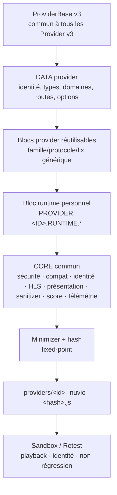
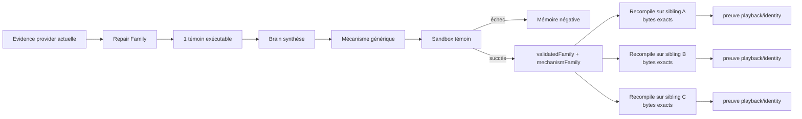

# NiakVIO — Architecture des familles Provider v3

> [!IMPORTANT]
> Ce document décrit **comment les providers partagent des briques communes tout en conservant leur runtime personnel**.
> Il complète [ARCHITECTURE.md](ARCHITECTURE.md) et [BRAIN_REPAIR_ARCHITECTURE.md](BRAIN_REPAIR_ARCHITECTURE.md).
>
> Une **famille de runtime/protocole** et une **famille de panne/réparation Brain** sont deux notions différentes. Elles peuvent se recouper, mais ne doivent jamais être confondues.

---

## 1. Vue d'ensemble



Formule de matérialisation :

```text
Provider publié
=
ProviderBase v3
+ DATA personnelle
+ Blocs PROVIDER.* partagés applicables
+ Bloc(s) PROVIDER.<ID>.* personnel(s)
+ Blocs CORE.* communs
+ minimizer conservateur
```

Le runtime personnel ne remplace donc **jamais** les briques Core communes.

---

## 2. Les quatre niveaux d'ownership

| Niveau | Portée | Exemples | Peut être appris/réutilisé entre providers ? |
| --- | --- | --- | --- |
| **A. ProviderBase** | Tous les providers v3 | enveloppe, API ProviderBase, helpers de base | Oui, globalement |
| **B. Famille Provider** | Plusieurs providers partageant un mécanisme | parser DLE, traversal iframe/player, fix DOM générique, stratégie terminale | Oui, seulement si le mécanisme est réellement générique |
| **C. Provider personnel** | Un provider exact | domaine, routes, headers, options, runtime `<provider>_runtime_vN.py` | Non par copie brute ; seulement comme prior/pattern |
| **D. CORE** | Tous les providers ou toute une capacité | sécurité, identité, HLS, sanitizer, StreamScore, télémétrie | Oui, globalement ; hors ownership Repair provider |

### Règle centrale

```text
famille = mécanisme partagé
provider = protocole/adressage exact
Core = politique globale de sécurité / présentation / validation
```

Un Brain Repair provider-local ne doit pas déplacer une responsabilité du Core dans le runtime personnel.

---

## 3. Blocs CORE communs

L'ordre canonique est défini par `CANONICAL_CORE_MANAGED_ORDER` dans
`scripts/apply_provider_overrides.py`.

```text
CORE.DESKTOP_RUNTIME_COMPAT.V1
        ↓
CORE.CATALOGUE_ALIAS_RECOVERY.V2
        ↓
CORE.MEDIA_ENRICHMENT.V1
        ↓
CORE.HLS_RUNTIME_INTEGRITY.V1
        ↓
CORE.PROVIDER_SECURITY_BOUNDARY.V1
        ↓
CORE.RUNTIME_COMPAT.V1
        ↓
CORE.PROVIDER_RUNTIME_DISPATCH.V1
        ↓
CORE.STREAM_FACTS.V1
        ↓
CORE.STREAM_IDENTITY.V1
        ↓
CORE.MEDIA_TYPE_RESOLUTION.V1
        ↓
CORE.STREAM_PRESENTATION.V1
        ↓
CORE.STREAM_SANITIZER.V6
        ↓
CORE.RUNTIME_MEDIA_SAFETY.V4
        ↓
CORE.PROVIDER_BRANDING.V1
        ↓
CORE.STREAM_SCORE.V1
        ↓
CORE.TELEMETRY.V1
```

### Rôle des principales briques

| Bloc commun | Rôle |
| --- | --- |
| **Desktop Runtime Compat** | compatibilité runtime Desktop |
| **Catalogue Alias Recovery** | récupération contrôlée des aliases/catalogues |
| **Media Enrichment** | enrichissement des faits média |
| **HLS Runtime Integrity** | inspection HLS, master/variant, durée, segments, facts techniques |
| **Provider Security Boundary** | frontière de sécurité commune avant/après runtime provider |
| **Runtime Compat** | compatibilité d'exécution globale |
| **Provider Runtime Dispatch** | branchement du resolver provider personnel dans le pipeline |
| **Stream Facts** | collecte normalisée des faits techniques |
| **Stream Identity** | cohérence œuvre/saison/épisode/langue/identité |
| **Media Type Resolution** | movie/tv/anime et aliases de transport |
| **Stream Presentation** | titre, description, qualité, badges |
| **Stream Sanitizer** | validation terminale/fail-closed des sorties |
| **Runtime Media Safety** | garde-fous média/runtime |
| **Provider Branding** | identité visuelle/provider |
| **Stream Score** | score global et badge associé |
| **Telemetry** | télémétrie commune, sans logique métier provider |

Implémentations actuelles importantes :

```text
scripts/provider_patches/global_stream_facts_v1.py
scripts/provider_patches/global_stream_identity_v1.py
scripts/provider_patches/global_media_type_resolution_v1.py
scripts/provider_patches/global_stream_presentation_v1.py
scripts/provider_patches/stream_output_sanitizer_v10.py
scripts/provider_patches/runtime_capability_media_safety_v4.py
scripts/provider_patches/global_provider_branding_v1.py
scripts/provider_patches/global_stream_score_v1.py
scripts/provider_patches/global_telemetry_v1.py
scripts/provider_patches/global_provider_security_hardening_v1.py
scripts/provider_patches/global_runtime_compat_v1.py
scripts/provider_patches/global_provider_runtime_dispatch_v1.py
scripts/provider_patches/desktop_runtime_compat_v1.py
```

> [!NOTE]
> Certains IDs de Bloc gardent un numéro historique pour compatibilité alors que le fichier d'implémentation courant a évolué, par exemple le sanitizer publié via l'implémentation v10.

---

## 4. Briques communes à une famille Provider

Une famille Provider peut partager des **mécanismes provider-level** sans devenir du Core.

Exemples de mécanismes réutilisables :

- parser de catalogue/search commun ;
- WordPress/DLE search ;
- traversal `search → detail → player → source` ;
- parser DOM avec conteneur équilibré ;
- extraction JSON/API ;
- iframe/embed traversal ;
- décodage player ;
- extraction terminale HLS/MP4 ;
- politique de headers/referer d'un protocole commun ;
- récupération session/cookies lorsqu'elle est générique et autorisée ;
- fix structurel Brain compilé pour une famille de panne.

Ces briques restent sous ownership `PROVIDER.*`, même si plusieurs providers les utilisent.

### Exemple conceptuel

```text
Famille "DLE anime"
├── Bloc commun famille : recherche DLE
├── Bloc commun famille : episode/player traversal
├── Provider A
│   ├── DATA A
│   └── runtime A : domaine/routes/options exactes
├── Provider B
│   ├── DATA B
│   └── runtime B : domaine/routes/options exactes
└── Core commun injecté après le runtime
```

Le champ historique `provider_lego_scripts` peut encore référencer ces Blocs dans la DATA sérialisée.
Le terme architectural public reste **Bloc**.

---

## 5. Runtime personnel du provider

Le runtime personnel est la partie qui sait parler au provider exact.

Forme habituelle :

```text
scripts/provider_patches/<provider>_runtime_vN.py
    ↓
MANAGED_FIX_ID = PROVIDER.<ID>.RUNTIME.*
    ↓
resolver / getStreams provider
    ↓
__niakvioProviderRuntimeResolverV1
    ↓
CORE.PROVIDER_RUNTIME_DISPATCH.V1
```

Exemples présents dans le dépôt :

```text
4khdhub_runtime_v1.py
allwish_runtime_v1.py
animesalt_runtime_v1.py
flemmix_runtime_v1.py
mallumv_runtime_v1.py
moviebox runtime/patch enregistré
moviesmod_runtime_v1.py
vidfast_runtime_v1.py
yflix_runtime_v1.py
```

Le runtime personnel peut contenir :

- route/search exacte ;
- construction de requête ;
- navigation catalogue → détail ;
- saison/épisode ;
- headers/referer propres au provider ;
- parsing du document/API ;
- traversal player/embed ;
- décodage spécifique ;
- extraction des URLs terminales.

Il **ne doit pas** réimplémenter :

- Stream Identity ;
- classification média globale ;
- sécurité Core ;
- HLS integrity globale ;
- présentation/badges ;
- sanitizer ;
- StreamScore ;
- télémétrie globale.

---

## 6. DATA personnelle

La DATA reste distincte du code runtime.

```text
provider-overrides.json
provider_catalog.json
provider-hubs.json
provider-type-policy.json
automation/provider-v3-static-knowledge.json
```

Une ligne provider peut notamment porter :

```text
id / canonical id
types canoniques
types de lancement
domaine/site courant
hub/adresse de découverte
routes connues
options du Bloc runtime
scripts/Blocs provider enregistrés
politique de domaine
capabilities
```

Le changement d'adresse d'un provider doit autant que possible modifier la DATA/CONFIG, pas créer un nouveau runtime.

---

## 7. Famille de runtime ≠ famille de réparation Brain

### Famille de runtime

Elle décrit **comment plusieurs providers fonctionnent**.

Exemples :

```text
DLE
WordPress REST
API JSON
catalogue HTML → detail → iframe
player/embed multi-hop
direct backend/API
```

### Famille de réparation

Elle décrit **pourquoi des providers échouent de manière similaire**.

Exemples actuels :

```text
route-proven-gap : route-parser
route-proven-gap : dom-selector-container
chain-terminal-gap : dom-selector-container
chain-terminal-gap : terminal-extraction
provider-transport-gap : provider-transport
```

Deux providers de runtimes totalement différents peuvent appartenir à la même famille de réparation si leur défaut causal est le même.

Inversement, deux providers de la même famille runtime peuvent casser pour des causes différentes.

---

## 8. Ce que le Brain partage réellement



Le partage ne signifie donc pas :

```text
copier le runtime de A vers B
```

Il signifie :

```text
réutiliser le mécanisme validé
+ le recompiler sur les bytes exacts de B
+ conserver la DATA/runtime personnel de B
+ repasser toutes les preuves
```

Si le mécanisme ne peut pas s'exprimer proprement sur B, B ressort de la famille de replay et repasse en synthèse LLM.

---

## 9. Brain-generated Bloc de famille

Lorsqu'un mécanisme générique est découvert mais qu'aucun Bloc existant ne suffit :

```text
evidence
  ↓
source window exacte
  ↓
mutation provider_bloc bornée
  ↓
compilation structurelle Brain
  ↓
renderer NiakVIO de confiance
  ↓
scripts/provider_patches/
brain_runtime_<family>_<fingerprint>_v1.py
  ↓
enregistrement sur le provider
  ↓
sandbox / playback / identité / non-régression
```

Le nom de famille dans un Bloc Brain sert à identifier le **mécanisme**, pas à fusionner les runtimes providers.

Un sibling peut donc recevoir le même mécanisme compilé différemment sur son propre code.

---

## 10. Frontière de sécurité

### Le Brain peut modifier

```text
provider_data
provider_patch
provider_bloc
provider_js authored lorsque explicitement autorisé
```

### Le Brain Repair provider ne peut pas modifier

```text
CORE.*
ProviderBase global
sécurité globale
sanitizer global
StreamScore global
Telemetry globale
publication/release authority
```

Le receiver NiakVIO doit notamment refuser :

- mutation Core cachée ;
- nouveau `eval` / process / import arbitraire ;
- chemin choisi librement par le modèle ;
- URL/token/secret synthétique ;
- dérive de signature async/sync non justifiée ;
- suppression de sémantique réseau nécessaire ;
- mutation hors bytes signés du contexte courant.

---

## 11. Exemple complet d'un provider membre d'une famille

```text
Provider X
│
├── ProviderBase v3                         [GLOBAL]
│
├── DATA X                                  [PERSONNEL]
│   ├── type: movie/tv
│   ├── domaine
│   ├── routes
│   └── options
│
├── Bloc parser/fix de famille              [FAMILLE]
│   └── ex: balanced DOM container
│
├── PROVIDER.X.RUNTIME.Vn                   [PERSONNEL]
│   ├── search
│   ├── detail
│   ├── episode
│   ├── player
│   └── terminal extraction
│
├── CORE.HLS_RUNTIME_INTEGRITY              [GLOBAL]
├── CORE.PROVIDER_SECURITY_BOUNDARY         [GLOBAL]
├── CORE.RUNTIME_COMPAT                     [GLOBAL]
├── CORE.PROVIDER_RUNTIME_DISPATCH          [GLOBAL]
├── CORE.STREAM_FACTS                       [GLOBAL]
├── CORE.STREAM_IDENTITY                    [GLOBAL]
├── CORE.MEDIA_TYPE_RESOLUTION              [GLOBAL]
├── CORE.STREAM_PRESENTATION                [GLOBAL]
├── CORE.STREAM_SANITIZER                   [GLOBAL]
├── CORE.RUNTIME_MEDIA_SAFETY               [GLOBAL]
├── CORE.PROVIDER_BRANDING                  [GLOBAL]
├── CORE.STREAM_SCORE                       [GLOBAL]
└── CORE.TELEMETRY                          [GLOBAL]
        ↓
   bundle Provider v3
        ↓
   sandbox / Retest
        ↓
   publication si preuve complète
```

---

## 12. Conséquence pour 800 providers

L'objectif n'est pas d'avoir :

```text
800 providers
→ 800 raisonnements LLM
→ 800 scripts indépendants
```

L'objectif est :

```text
800 providers
→ N familles de runtime
→ M familles de panne
→ bibliothèque croissante de mécanismes validés
→ replay déterministe sur bytes exacts
→ LLM uniquement pour les familles réellement nouvelles / exceptions
```

Donc la croissance souhaitée du coût est approximativement :

```text
coût ≈ nouvelles familles causales
     + nouveaux protocoles/runtime
     + exceptions provider
```

et non :

```text
coût ≈ nombre brut de providers
```

---

## 13. Invariants

1. Un fix familial ne devient jamais Core juste parce qu'il aide plusieurs providers.
2. Un runtime personnel ne doit jamais réimplémenter une politique Core.
3. Une famille Brain est définie par le mécanisme causal, pas par le nom du provider.
4. Un mécanisme familial validé reste `proofAuthority=false` pour un nouveau sibling jusqu'à son propre sandbox.
5. Le replay familial travaille toujours sur les bytes courants exacts.
6. Une divergence structurelle d'un sibling doit faire échouer la recompilation, pas forcer le patch.
7. Un timeout LLM n'est pas un échec fonctionnel du provider.
8. Un provider peut changer de famille de réparation lorsque les preuves évoluent.
9. Un provider peut utiliser plusieurs Blocs de famille mais garde une DATA et un runtime personnel identifiables.
10. La matérialisation finale réinjecte toujours les Blocs Core canoniques dans leur ordre défini.
