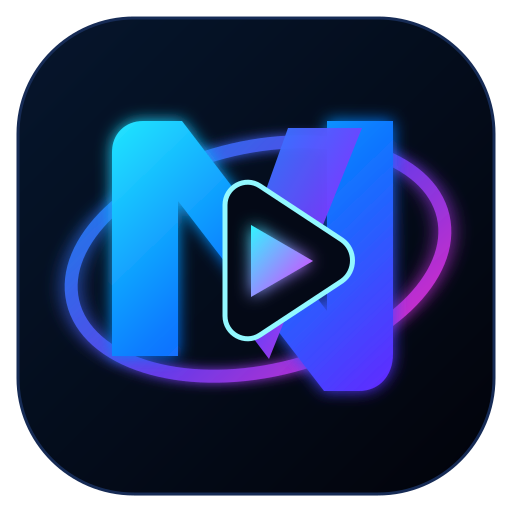

<div align="center">
  
  <br>
  

  <p><a href="README.md">English</a> · <strong>Français</strong></p>
  <h3>Une seule couche providers maintenue pour Nuvio.</h3>
  <p><strong>96 Provider Objects · VO / VF · TV / Mobile / Desktop</strong></p>
  <p>Installez une fois. Gardez un large catalogue providers sans empiler les addons, pendant que NiakVIO gère maintenance structurée, changements de domaines, validation et publications cache-safe.</p>
</div>

---

## Installer NiakVIO

### Manifest général — recommandé

```text
https://raw.githubusercontent.com/niakw/NiakVIO/refs/heads/main/manifest.json
```

### Manifest francophone

```text
https://raw.githubusercontent.com/niakw/NiakVIO/refs/heads/main/vf/manifest.json
```

### Manifest général sans providers orientés anime

```text
https://raw.githubusercontent.com/niakw/NiakVIO/refs/heads/main/no-anime/manifest.json
```

### Manifest francophone sans providers orientés anime

```text
https://raw.githubusercontent.com/niakw/NiakVIO/refs/heads/main/vf-no-anime/manifest.json
```

Guide manifest : [`docs/fr/how-to-add-manifest.md`](docs/fr/how-to-add-manifest.md)

### Feed StreamBadge

```text
https://raw.githubusercontent.com/niakw/NiakVIO/main/assets/stream-badges-fusion-v2.json
```

Guide StreamBadge : [`docs/fr/how-to-add-stream-badges.md`](docs/fr/how-to-add-stream-badges.md)

> NiakVIO n’héberge aucune vidéo. Le projet maintient métadonnées providers, connaissance protocolaire structurée, règles de compatibilité, manifests et bundles providers exécutés côté client.

> [!IMPORTANT]
> Les œuvres citées dans le code, les CI ou la documentation sont des **fixtures de test déterministes**, pas un catalogue. Voir [`TESTING_NOTICE.md`](TESTING_NOTICE.md) et [`DISCLAIMER.md`](DISCLAIMER.md).

---

## Pourquoi NiakVIO ?

Une couche providers est simple tant que tout reste statique. Le vrai problème commence quand les domaines tournent, les API changent, les lecteurs évoluent, un client Nuvio se comporte différemment d’un autre ou qu’une version provider reste bloquée en cache.

NiakVIO est construit autour de ce problème de maintenance.

- **96 Provider Objects conservés dans le census** — un provider désactivé ou non résolu n’est pas supprimé silencieusement pour améliorer artificiellement un taux de réussite.
- **Projections VO/VF** — un catalogue maintenu avec des manifests dédiés au français.
- **Moins d’addons providers empilés** — NiakVIO est pensé pour être la couche providers, pas un pack supplémentaire ajouté au-dessus de plusieurs packs concurrents.
- **Connaissance structurée** — routes, requêtes, identité média et domaines officiels ne sont pas enfermés uniquement dans du JS publié opaque.
- **Architecture réparable** — les défauts communs peuvent être corrigés au niveau famille/Core ; les changements incertains passent par Learning au lieu de muter le runtime à l’aveugle.
- **Preuves natives** — TV Android, Mobile Android, Mobile iOS, macOS et Windows sont traités comme cinq frontières de compatibilité distinctes.
- **Publication cache-safe** — versions provider/manifest, bundles adressés par contenu et hashes de release restent synchronisés pour que Nuvio reçoive réellement la nouvelle génération.
- **Validation fail-closed** — zéro flux, mauvais média, conteneur malformé ou panne upstream d’un client restent des états distincts au lieu d’être maquillés en succès.

<div align="center">
  
</div>

---

## Configuration Nuvio recommandée

<div align="center">
  
  <p><strong>Gardez une stack simple : un outil par rôle.</strong></p>
</div>

<table>
  <tr>
    <td align="center" width="25%">
      <br>
      <strong>Providers</strong><br>
      NiakVIO uniquement
    </td>
    <td align="center" width="25%">
      <br>
      <strong>Métadonnées / catalogue</strong><br>
      UltraMax
    </td>
    <td align="center" width="25%">
      <br>
      <strong>Sous-titres</strong><br>
      SubSense
    </td>
    <td align="center" width="25%">
      <br>
      <strong>Favoris / suivi</strong><br>
      SIMKL
    </td>
  </tr>
</table>

L’idée est volontairement simple : **une couche providers, un addon catalogue/métadonnées, un addon sous-titres et un service de suivi**. Évitez d’empiler plusieurs addons providers qui doublonnent le même rôle et rendent les erreurs, le cache et la sélection des sources plus difficiles à comprendre.

---

## NiakVIO vs un manifest provider brut

Un provider ou manifest autonome peut très bien convenir. NiakVIO prend surtout son sens quand l’objectif devient un **gros catalogue providers mouvant, maintenable sur plusieurs clients Nuvio**.

| Capacité | Provider / manifest brut | NiakVIO |
|---|---|---|
| Installation | Un ou plusieurs manifests providers | Une couche stable avec projections générales/VF |
| Maintenance catalogue | Principalement manuelle | 96 Provider Objects conservés et audités |
| Source durable | Souvent le JS publié | ProviderBase v3 + DATA structurée + Lego Provider/Core détenus |
| Connaissance routes | Souvent enfouie dans le code | Routes/requêtes/provenance structurées |
| Rotation domaines | Changement manuel/statique | Découverte hub officiel + refresh `official_site` borné |
| Types média | Type de lancement et capacité sémantique parfois mélangés | Capacité canonique séparée de la compatibilité transport Nuvio |
| Diagnostic | Souvent zéro flux / erreur générique | Preuves search, detail, episode, runtime, player, media, device |
| Réparation | Réécriture manuelle | Réparation famille/Core + propositions Learning reviewables |
| Couverture clients | Souvent extrapolée depuis un seul runtime | Cinq Labs natifs indépendants |
| Publication | Remplacement de fichier | Versions provider cache-safe + génération manifest + hashes d’intégrité |
| Sécurité | Dépend de la source | Exécution bornée, contrôles réseau/ressources et contrats de sanitization |

---

## Pensé pour les clients Nuvio officiels

Chaque client/device est une frontière de compatibilité indépendante :

- **TV Android** — [NuvioTV](https://github.com/NuvioMedia/NuvioTV)
- **Mobile Android** — [NuvioMobile](https://github.com/NuvioMedia/NuvioMobile)
- **Mobile iOS** — [NuvioMobile](https://github.com/NuvioMedia/NuvioMobile)
- **Desktop macOS** — [NuvioDesktop](https://github.com/NuvioMedia/NuvioDesktop)
- **Desktop Windows** — [NuvioDesktop](https://github.com/NuvioMedia/NuvioDesktop)

Une preuve Desktop ne vaut jamais automatiquement preuve Android/iOS/TV. Les Labs consomment les clients officiels tels quels : une erreur upstream de compilation, packaging, runtime, player ou QuickJS reste visible au lieu d’être patchée dans NiakVIO uniquement pour obtenir une CI verte.

---

## Sous le capot

### Provider v3

Les bundles providers sont reconstruits depuis :

```text
ProviderBase v3
+ DATA/connaissance statique provider structurée
+ Lego PROVIDER.*
+ Lego CORE.*
+ minimizer NiakVIO sécurisé
```

Les fichiers publiés `providers/*.js` sont des artefacts runtime adressés par contenu, **jamais des seeds de reconstruction**. Le JavaScript upstream/historique sert uniquement de connaissance et de provenance.

La reconstruction complète doit finir par une preuve de reverse rebuild byte-identique. Terser est interdit ; `scripts/provider_v3_minimizer.py` reste volontairement conservateur et s’exécute avant le hashing.

Voir [`ARCHITECTURE.md`](ARCHITECTURE.md).

### DATA routes / protocoles

La source durable est :

```text
provider.model.routeData
```

La reconnaissance peut conserver méthode, encodage/body, `Referer`, `Origin`, type de réponse, placeholders, rôle, provenance et confiance. L’analyse statique peut récupérer variables, concaténations et templates sans traiter le bundle provider publié comme source d’autorité.

Une absence de route prouvée signifie **inconnu**, pas automatiquement mort ou quarantiné.

### Types média : capacité sémantique vs transport Nuvio

`canonicalSupportedTypes` décrit ce que le catalogue du provider sert réellement (`movie`, `tv`, `anime`). `supportedTypes` décrit comment Nuvio peut lancer le provider.

Un provider exclusivement anime peut donc légitimement exposer :

```json
{
  "canonicalSupportedTypes": ["anime"],
  "supportedTypes": ["anime", "tv", "movie"]
}
```

`tv` transporte les anime épisodiques et `movie` les films anime. Ces alias ne transforment **pas** le provider en provider film/série générique ; un contenu non-anime doit toujours être rejeté par la logique d’identité autoritaire.

### Règles runtime

Le Provider JS est un reader spécialisé, pas un crawler ni un moteur Learning.

- gate capacité/type avant tout réseau provider ;
- enrichissement TMDB uniquement si le plan provider en a besoin ;
- identité scoped par œuvre/type/saison/épisode ;
- provider incompatible → `[]`, pas recherche arbitraire ;
- Core ne traite les sorties qu’après présence de flux utiles ;
- zéro flux ne fabrique jamais un succès ;
- mauvais média = échec ;
- un flux cassé ne désactive jamais tout le provider à lui seul.

### Reader, transport et lecture

Une URL `.m3u8` ou une réponse `#EXTM3U` ne prouve pas une lecture native. NiakVIO sépare extraction, identité, contexte de requête, résolution playlist/variant, intégrité média/conteneur et résultat réel du player natif.

HTML/JSON déguisé en média ou TS/fMP4 positivement malformé peut être rejeté. Un timeout, une panne temporaire, un flux chiffré ou une API byte indisponible reste **inconclusif**, pas une preuve de panne provider généralisée.

---

## CORE, Learning et Domain Refresh

`CORE - Verify & Publish` est le workflow courant de publication.

- **Quick** — checks déterministes structure/runtime/unit/security/minimizer. Aucune réparation/reconstruction provider.
- **Deep** — observation réseau/hub plus large en lecture seule, health providers, projections, rapports et inventaires d’intégrité. Toujours aucune réparation/reconstruction Provider JS.
- **Learning** — seul chemin isolé d’évolution/réparation du code. Les changements restent reviewables avant publication.
- **Domain Refresh** — maintenance volontairement limitée au DATA CONFIG `official_site` validé.

Cette séparation évite qu’un simple health check réécrive silencieusement un provider parce qu’un site est temporairement indisponible.

---

## Publication et intégrité

La publication est atomique et fail-closed et peut inclure :

- `provider_catalog.json` ;
- bundles providers adressés par contenu ;
- `manifest.json` et projections VF/no-anime ;
- état provenance/domaines ;
- versions providers/cache synchronisées ;
- hashes de release et rapports allowlistés.

Une génération incohérente ne doit jamais remplacer silencieusement un état publié sain.

---

## Principaux workflows

| Workflow | Responsabilité |
|---|---|
| `sync.yml` | **CORE - Verify & Publish** Quick/Deep ; aucune réparation/reconstruction provider |
| `provider-v3-reconstruct-routes.yml` | reconnaissance route-only / census `routeData` canonique |
| `provider-v3-reconstruct-all.yml` | reconstruction complète Provider v3 + reverse byte proof |
| `brain-learning-lab.yml` | observation/réparation Learning sandbox + propositions reviewables |
| `domain-refresh.yml` | maintenance `official_site` CONFIG uniquement |
| `add-provider.yml` | onboarding provider structuré |
| `native-mobile-android-reader.yml` | preuves TV Android + Mobile Android |
| `native-mobile-ios-reader.yml` | preuves Mobile iOS |
| `native-desktop-reader-acceptance.yml` | preuves Desktop macOS + Windows |
| `native-corpus-device-targeted.yml` | diagnostics ciblés device/provider |
| `github-actions-gate.yml` | invariants sécurité workflows/dépendances |
| `codeql.yml` | analyse CodeQL |
| `weekly-upstream-provider-discovery.yml` | découverte upstream en lecture seule |
| `purge-actions-history.yml` | nettoyage historique Actions |
| `brain-branch-maintenance.yml` | maintenance de la branche Learning/proposals |

---

## Merci & connaissances upstream

NiakVIO est indépendant, mais profite du travail publié dans l’écosystème providers Nuvio.

<table>
  <tr>
    <td align="center" width="33%">
      <br>
      <strong>Gowaru</strong><br>
      Implémentations providers et connaissance protocolaire utilisées comme provenance/évidence upstream lorsque pertinent.
    </td>
    <td align="center" width="33%">
      <br>
      <strong>Yoru</strong><br>
      Travail sur l’écosystème providers et implémentations utiles pour croiser comportements et compatibilité.
    </td>
    <td align="center" width="33%">
      <br>
      <strong>All-in-One Nuvio / D3adlyRocket</strong><br>
      Matériel historique d’agrégation/mirror utilisé comme une source de provenance, jamais comme autorité de reconstruction NiakVIO.
    </td>
  </tr>
</table>

---

## Sécurité, responsabilité et indépendance

Le JavaScript provider est traité comme une entrée non fiable. NiakVIO utilise workers bornés, contrôles SSRF/réseau, sandboxing, vérifications d’identité, sanitization CI et publication fail-closed. Le stripping HTML générique par regex est interdit par le contrat sécurité Provider v3.

NiakVIO est un projet communautaire indépendant, non affilié à Nuvio ni aux services tiers cités. Rien dans ce repository n’accorde de droits sur des médias/services tiers et n’autorise le contournement d’authentification, paywalls, chiffrement ou contrôles d’accès.

Voir [`SECURITY.md`](SECURITY.md), [`TESTING_NOTICE.md`](TESTING_NOTICE.md), [`DISCLAIMER.md`](DISCLAIMER.md), [`LICENSE`](LICENSE), [`NOTICE`](NOTICE), [`CONTRIBUTING.md`](CONTRIBUTING.md) et [`CODE_OF_CONDUCT.md`](CODE_OF_CONDUCT.md).
