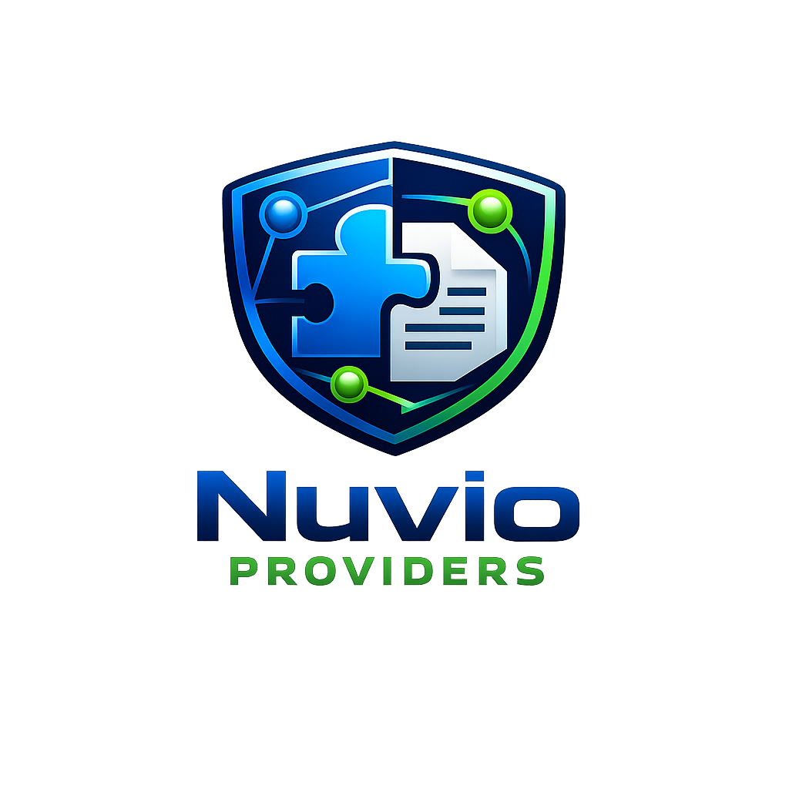

<div align="center">
  

  <h1>NiakVIO</h1>
  <p><a href="README.md">English</a> · <strong>Français</strong></p>
  <p><strong>Le moteur communautaire qui agrège, teste, répare et maintient les providers Nuvio.</strong></p>
  <p>VO · VF &nbsp;•&nbsp; Mobile · Desktop · TV</p>

[](package.json)
[](LICENSE)
[](#compatibilit%C3%A9-nuvio)

</div>

---

## Ajouter NiakVIO à Nuvio

### Manifest général — recommandé ([Comment l’ajouter ?](docs/fr/how-to-add-manifest.md))

Tous les providers publiés : VF, VO et autres langues explicitement déclarées par les providers ou les flux.

```text
https://raw.githubusercontent.com/niakw/NiakVIO/refs/heads/main/manifest.json
```

### Manifest francophone ([Comment l’ajouter ?](docs/fr/how-to-add-manifest.md))

Projection centrée sur les providers proposant du français lorsque cette langue est explicitement déclarée par le provider ou le flux.

```text
https://raw.githubusercontent.com/niakw/NiakVIO/refs/heads/main/vf/manifest.json
```

### Badges StreamBadge — recommandé ([Comment les ajouter ?](docs/fr/how-to-add-stream-badges.md))

Pour un réglage unique au niveau du compte Nuvio, utilisez le feed **Fusion v2**. Il emploie les variantes 96×40 avec chip sombre conçues pour rester lisibles sur fonds sombres comme clairs.

**Fusion v2 — recommandé**

```text
https://raw.githubusercontent.com/niakw/NiakVIO/main/assets/stream-badges-fusion-v2.json
```

> NuvioTV conserve localement les règles d'un feed déjà importé. Si l'ancien `stream-badges-fusion.json` avait déjà été ajouté, supprimez cet import puis ajoutez **Fusion v2** : l'URL versionnée force un import frais des règles corrigées.

Feeds spécifiques si le client peut sélectionner le thème :

**Fond sombre / gris**

```text
https://raw.githubusercontent.com/niakw/NiakVIO/main/assets/stream-badges-dark.json
```

**Fond clair / blanc**

```text
https://raw.githubusercontent.com/niakw/NiakVIO/main/assets/stream-badges-light.json
```

Catalogue complet et mapping Core/Brain/UI : [`badge_catalog_v2_complete.json`](assets/badge_catalog_v2_complete.json) · [`mapping_core_brain_ui_v2_complete.json`](assets/mapping_core_brain_ui_v2_complete.json) · [documentation badges/assets](assets/README.md).

Dans Nuvio, copiez l'URL du manifest souhaité dans la gestion des plugins/providers, puis ajoutez le feed badges dans les réglages StreamBadge lorsque cette fonction est disponible. **Le feed StreamBadge est indépendant du manifest providers.**

**Les URL restent stables.** NiakVIO peut faire évoluer derrière elles les bundles, versions, domaines, règles runtime, preuves et états d'activation.

> NiakVIO ne stocke ni n'héberge de vidéo. Le projet maintient des manifests, des métadonnées, des règles de compatibilité et des bundles de providers consommés côté client.

> [!IMPORTANT]
> **Références d'œuvres = fixtures de test.** Les titres, années, saisons ou épisodes visibles dans ce README, le code, les logs CI et les artefacts servent uniquement d'**identifiants déterministes de test** pour vérifier le matching, la compatibilité et les régressions de type « mauvais média ». Leur présence ne constitue ni un catalogue, ni une mise à disposition, ni une recommandation, ni une déclaration sur les droits/licences d'un service tiers. NiakVIO ne doit pas publier de média, extrait, sous-titre, clé de déchiffrement, jeton d'accès ou URL complète de lecture. **Les exceptions et limitations au droit d'auteur varient selon les pays : NiakVIO ne présume d'aucune exception locale et n'accorde aucun droit d'accès ou d'utilisation.** Voir [`TESTING_NOTICE.md`](TESTING_NOTICE.md) et [`DISCLAIMER.md`](DISCLAIMER.md).

---

## Écosystème et sources

### Clients Nuvio officiels

- [Nuvio Mobile — `NuvioMedia/NuvioMobile`](https://github.com/NuvioMedia/NuvioMobile)
- [Nuvio Desktop — `NuvioMedia/NuvioDesktop`](https://github.com/NuvioMedia/NuvioDesktop)
- [NuvioTV — `NuvioMedia/NuvioTV`](https://github.com/NuvioMedia/NuvioTV)

### Repositories providers suivis

NiakVIO agrège et compare plusieurs upstreams au lieu de dépendre d'une seule copie d'un provider :

- [Gowaru — `Gowaru/gowaru-nuvio-providers`](https://github.com/Gowaru/gowaru-nuvio-providers)
- [Yoru — `yoruix/nuvio-providers`](https://github.com/yoruix/nuvio-providers)
- [All-in-One Nuvio — `NuvioPlugin/All-in-One-Nuvio`](https://github.com/NuvioPlugin/All-in-One-Nuvio)

La provenance et les licences tierces sont suivies dans [`PROVENANCE.json`](PROVENANCE.json) et [`THIRD_PARTY_NOTICES.md`](THIRD_PARTY_NOTICES.md).

---

## Pourquoi NiakVIO ?

Un provider peut fonctionner aujourd'hui puis casser demain à cause d'un domaine déplacé, d'une API modifiée, d'un lecteur remplacé, d'un token devenu obsolète ou d'une différence entre Mobile, Desktop et TV.

NiakVIO ajoute une couche de maintenance entre les repositories providers et Nuvio :

- **un point d'installation unique** plutôt qu'une collection de manifests à gérer séparément ;
- **plusieurs variantes comparées** avant de modifier du code ;
- **réparation automatique bornée** lorsque la meilleure variante connue ne fonctionne plus ;
- **contrôle réel du média**, pas seulement de l'URL retournée ;
- **vérification de l'œuvre, de la saison et de l'épisode** pour éviter les faux positifs ;
- **attention particulière au français** sans inventer VF à partir d'un simple nom de domaine ;
- **preuves séparées Mobile, Desktop et TV** ;
- **dernier état sain conservé** lorsqu'une nouvelle observation est seulement inconclusive ;
- **publication atomique et fail-closed** pour empêcher une génération partielle de remplacer silencieusement un état sain.

L'objectif n'est donc pas d'afficher le plus grand nombre possible de providers. L'objectif est de publier **le plus de providers réellement utiles possible, avec suffisamment de preuves pour savoir pourquoi ils fonctionnent — ou pourquoi ils ne fonctionnent plus.**

---

## Ce que NiakVIO maintient automatiquement

### Providers et variantes

Pour une même famille, NiakVIO peut disposer de plusieurs bundles issus des upstreams, d'un dernier état publié et d'un LKG. La sélection d'un sibling sain est tentée avant une réparation structurelle.

### Domaines et routes

Le moteur distingue notamment :

- hub d'information ;
- domaine terminal ;
- redirection ;
- API ;
- peer observé ;
- domaine historique encore cohérent ;
- route appartenant à un autre provider.

Une migration de domaine n'est pas promue simplement parce qu'un serveur répond en HTTP.

### Extraction média

Lorsque cela est nécessaire, la récupération peut suivre la chaîne réelle :

```text
provider
  → recherche / catalogue / API
  → fiche exacte de l'œuvre
  → saison / épisode
  → iframe / lecteur
  → JavaScript / XHR / JSON
  → playlist / média final
```

Les budgets de pages, embeds, hosts, fetches, taille de réponse et temps empêchent cette exploration de devenir une navigation sans limite.

### Lecture réelle

Une URL n'est pas considérée comme valide uniquement parce qu'elle se termine par `.m3u8` ou `.mp4`. Les contrôles peuvent confirmer ou rejeter :

- playlist HLS réelle (`#EXTM3U`) ;
- DASH/MPD ;
- signatures de conteneurs ;
- HTML ou JSON déguisé en média ;
- publicité, preview ou asset parasite ;
- redirection incohérente ;
- premier segment ou contenu inaccessible ;
- contexte `Referer` / `Origin` / headers nécessaire à la lecture.

### Identité du contenu

Un flux jouable correspondant à la mauvaise œuvre est un **échec**, pas un succès.

Les preuves peuvent combiner titre, alias, année, type, saison, épisode, metadata catalogue/player, nom du média et durée attendue/mesurée.

### Langues

La langue d'un flux n'est jamais déduite d'un seul indice. NiakVIO conserve en priorité les indications explicitement fournies par le provider ou le flux et peut les croiser avec les métadonnées disponibles. **Les sous-titres ne sont ni inférés ni garantis par NiakVIO** : seule une indication explicitement exposée par un provider ou dans la description/métadonnée d'un flux peut être affichée.

---

## Compatibilité Nuvio

Les commits clients audités sont suivis dans [`automation/nuvio-client-upstreams.json`](automation/nuvio-client-upstreams.json) et [`sources.json`](sources.json). Les Labs résolvent le **HEAD officiel courant** de chaque branche client suivie, vérifient le drift de contrat, puis utilisent ce SHA exact comme baseline en lecture seule.

| Client | Repository | Preuve native retenue |
|---|---|---|
| Nuvio Mobile | [`NuvioMedia/NuvioMobile`](https://github.com/NuvioMedia/NuvioMobile) | chemin Android officiel et stack de lecture du client |
| Nuvio Desktop | [`NuvioMedia/NuvioDesktop`](https://github.com/NuvioMedia/NuvioDesktop) | bridges/lecteurs natifs **macOS et Windows** ; le stub Linux n'est pas une preuve lecteur |
| NuvioTV | [`NuvioMedia/NuvioTV`](https://github.com/NuvioMedia/NuvioTV) | Android TV officiel avec Media3/ExoPlayer |

Le contrat logique ARCHI 2 est commun, mais **une preuve Desktop ne vaut jamais automatiquement preuve Mobile ou TV**.

Les labs natifs parcourent les lignes du manifest compatibles avec la plateforme, **y compris les providers `enabled:false`**, et lisent **chaque stream retourné** sur des routes représentatives film, série et anime. Les routes incompatibles sont comptabilisées comme skips explicites ; les probes `tv/anime` non déclarés restent des preuves de capacité et ne déclenchent pas de réparation provider sur un simple échec.

Les profils Nuvio, snapshots AVD, caches providers et caches Gradle sont conservés lorsque c'est sûr afin d'éviter de reconstruire inutilement l'environnement. Les retests ciblés par device restent disponibles manuellement.

---

<!-- NIAKVIO_PROVIDER_RESULTS_START -->
## Providers actifs & résultats natifs vérifiés

<div align="center">


</div>

> **Ici, NiakVIO n'affiche que des succès natifs réellement conservés.** Une preuve signifie que le lecteur officiel Nuvio a atteint un état sain pour le **provider + fixture de test + device exacts**. L'absence de preuve n'est jamais maquillée en succès — et n'est pas non plus présentée comme un échec.

> **Cadre des œuvres citées :** les titres/épisodes du tableau sont des **fixtures de test**, pas un catalogue ni une offre de contenu. Les résultats décrivent uniquement une observation technique sanitizée. Voir [`TESTING_NOTICE.md`](TESTING_NOTICE.md) et [`DISCLAIMER.md`](DISCLAIMER.md).

**13 providers** disposent actuellement d'au moins une preuve lecteur native conservée, sur **4 cas de lecture distincts** et **1 plateforme native** déjà représentée. L'inventaire complet reste synchronisé automatiquement sur `manifest.json`.

### 📡 Couverture des lecteurs officiels

Cette vue distingue **support du lecteur** et **preuve positive conservée** : les quatre familles sont suivies en permanence, même lorsqu'aucune preuve saine n'a encore été retenue pour l'une d'elles.

| Lecteur officiel | Preuves positives conservées | Providers avec preuve | Dernière preuve | État |
|---|---:|---:|---:|---|
| 📺 **TV** | **30** | **13** | `2026-08-23` | ✅ Couvert par une preuve native |
| 📱 **Mobile** | **0** | **0** | `—` | 🟡 Suivi actif · aucune preuve positive conservée |
| 🖥️ **Desktop macOS** | **0** | **0** | `—` | 🟡 Suivi actif · aucune preuve positive conservée |
| 🪟 **Desktop Windows** | **0** | **0** | `—` | 🟡 Suivi actif · aucune preuve positive conservée |

### ✅ Lectures natives confirmées

| Provider | Fixtures de test réellement validées | Lecteurs officiels confirmés | Preuves | Dernière validation |
|---|---|---|---:|---:|
| &nbsp; **Cineby** | 📺 Breaking Bad S01E01 · Série<br>🎌 Jujutsu Kaisen S01E01 · Anime<br>🎬 Sinners 2025 · Film<br>🎬 Sinners · Film | 📺 **TV** ✅ | **4** | `2026-08-23` |
| &nbsp; **VidEasy** | 📺 Breaking Bad S01E01 · Série<br>🎌 Jujutsu Kaisen S01E01 · Anime<br>🎬 Sinners 2025 · Film<br>🎬 Sinners · Film | 📺 **TV** ✅ | **4** | `2026-08-23` |
| &nbsp; **Castle** | 📺 Breaking Bad S01E01 · Série<br>🎌 Jujutsu Kaisen S01E01 · Anime<br>🎬 Sinners 2025 · Film | 📺 **TV** ✅ | **3** | `2026-08-23` |
| &nbsp; **HindMoviez** | 📺 Breaking Bad S01E01 · Série<br>🎌 Jujutsu Kaisen S01E01 · Anime<br>🎬 Sinners 2025 · Film | 📺 **TV** ✅ | **3** | `2026-08-23` |
| &nbsp; **PlayIMDb** | 📺 Breaking Bad S01E01 · Série<br>🎌 Jujutsu Kaisen S01E01 · Anime<br>🎬 Sinners 2025 · Film | 📺 **TV** ✅ | **3** | `2026-08-23` |
| &nbsp; **Purstream** | 📺 Breaking Bad S01E01 · Série<br>🎌 Jujutsu Kaisen S01E01 · Anime<br>🎬 Sinners 2025 · Film | 📺 **TV** ✅ | **3** | `2026-08-23` |
| &nbsp; **VegaMovies** | 📺 Breaking Bad S01E01 · Série<br>🎌 Jujutsu Kaisen S01E01 · Anime<br>🎬 Sinners 2025 · Film | 📺 **TV** ✅ | **3** | `2026-08-23` |
| &nbsp; **AnimeZeY** | 📺 Breaking Bad S01E01 · Série<br>🎌 Jujutsu Kaisen S01E01 · Anime | 📺 **TV** ✅ | **2** | `2026-08-23` |
| &nbsp; **AnikotoTV** | 🎌 Jujutsu Kaisen S01E01 · Anime | 📺 **TV** ✅ | **1** | `2026-08-22` |
| &nbsp; **Anime-Sama** | 🎌 Jujutsu Kaisen S01E01 · Anime | 📺 **TV** ✅ | **1** | `2026-08-23` |
| &nbsp; **AnimeSama.co (DLE Mirror)** | 🎌 Jujutsu Kaisen S01E01 · Anime | 📺 **TV** ✅ | **1** | `2026-08-22` |
| &nbsp; **HiAnime** | 🎌 Jujutsu Kaisen S01E01 · Anime | 📺 **TV** ✅ | **1** | `2026-08-22` |
| &nbsp; **StreamZo** | 🎬 Sinners 2025 · Film | 📺 **TV** ✅ | **1** | `2026-08-23` |

<details>
<summary><strong>🟢 Voir les 51 providers actifs</strong> — inventaire complet synchronisé au manifest</summary>

La liste ci-dessous décrit **l'état de publication**, pas une supposition sur la lecture. Les providers déjà prouvés natifs sont signalés ; les autres restent simplement actifs dans le manifest jusqu'à ce qu'une preuve positive soit conservée.

| Provider | Types publiés | État de confiance public |
|---|---|---|
| &nbsp; **AnikotoTV** | 🎌 Anime · 🎬 Film | ✅ **Preuve native conservée** · 1 validation lecteur |
| &nbsp; **Anime-Sama** | 🎬 Film · 🎌 Anime | ✅ **Preuve native conservée** · 1 validation lecteur |
| &nbsp; **AnimeSama.co (DLE Mirror)** | 🎬 Film · 🎌 Anime | ✅ **Preuve native conservée** · 1 validation lecteur |
| &nbsp; **AnimeZeY** | 🎬 Film · 📺 Série | ✅ **Preuve native conservée** · 2 validations lecteur |
| &nbsp; **Castle** | 🎬 Film · 📺 Série | ✅ **Preuve native conservée** · 3 validations lecteur |
| &nbsp; **Cineby** | 🎬 Film · 📺 Série | ✅ **Preuve native conservée** · 4 validations lecteur |
| &nbsp; **HiAnime** | 🎌 Anime | ✅ **Preuve native conservée** · 1 validation lecteur |
| &nbsp; **HindMoviez** | 🎬 Film · 📺 Série | ✅ **Preuve native conservée** · 3 validations lecteur |
| &nbsp; **PlayIMDb** | 🎬 Film · 📺 Série | ✅ **Preuve native conservée** · 3 validations lecteur |
| &nbsp; **Purstream** | 🎬 Film · 📺 Série · 🎌 Anime | ✅ **Preuve native conservée** · 3 validations lecteur |
| &nbsp; **StreamZo** | 🎬 Film · 📺 Série · 🎌 Anime | ✅ **Preuve native conservée** · 1 validation lecteur |
| &nbsp; **VegaMovies** | 🎬 Film · 📺 Série | ✅ **Preuve native conservée** · 3 validations lecteur |
| &nbsp; **VidEasy** | 🎬 Film · 📺 Série | ✅ **Preuve native conservée** · 4 validations lecteur |
| &nbsp; **4KHDHub** | 🎬 Film · 📺 Série | 🟢 **Actif dans le manifest** · prochaine preuve native conservée dès validation positive |
| &nbsp; **AllMovieLand** | 🎬 Film · 📺 Série | 🟢 **Actif dans le manifest** · prochaine preuve native conservée dès validation positive |
| &nbsp; **AniDB** | 🎌 Anime | 🟢 **Actif dans le manifest** · prochaine preuve native conservée dès validation positive |
| &nbsp; **AnimePahe** | 🎌 Anime · 🎬 Film · 📺 Série | 🟢 **Actif dans le manifest** · prochaine preuve native conservée dès validation positive |
| &nbsp; **AnimeSalt** | 🎌 Anime · 🎬 Film · 📺 Série | 🟢 **Actif dans le manifest** · prochaine preuve native conservée dès validation positive |
| &nbsp; **AnimesUltra** | 🎬 Film · 🎌 Anime | 🟢 **Actif dans le manifest** · prochaine preuve native conservée dès validation positive |
| &nbsp; **Animetsu** | 🎌 Anime | 🟢 **Actif dans le manifest** · prochaine preuve native conservée dès validation positive |
| &nbsp; **AnimeVOSTFR** | 🎬 Film · 🎌 Anime | 🟢 **Actif dans le manifest** · prochaine preuve native conservée dès validation positive |
| &nbsp; **AniZone** | 🎌 Anime | 🟢 **Actif dans le manifest** · prochaine preuve native conservée dès validation positive |
| &nbsp; **CinemaCity** | 🎬 Film · 📺 Série | 🟢 **Actif dans le manifest** · prochaine preuve native conservée dès validation positive |
| &nbsp; **CineMM** | 🎬 Film · 📺 Série | 🟢 **Actif dans le manifest** · prochaine preuve native conservée dès validation positive |
| &nbsp; **Coflix** | 🎬 Film · 📺 Série · 🎌 Anime | 🟢 **Actif dans le manifest** · prochaine preuve native conservée dès validation positive |
| &nbsp; **DesiFlix** | 🎬 Film · 📺 Série | 🟢 **Actif dans le manifest** · prochaine preuve native conservée dès validation positive |
| &nbsp; **DooFlix** | 🎬 Film · 📺 Série | 🟢 **Actif dans le manifest** · prochaine preuve native conservée dès validation positive |
| &nbsp; **DuLourd** | 🎌 Anime · 📺 Série | 🟢 **Actif dans le manifest** · prochaine preuve native conservée dès validation positive |
| &nbsp; **Flemmix** | 🎬 Film · 📺 Série | 🟢 **Actif dans le manifest** · prochaine preuve native conservée dès validation positive |
| &nbsp; **French-Manga** | 🎬 Film · 🎌 Anime | 🟢 **Actif dans le manifest** · prochaine preuve native conservée dès validation positive |
| &nbsp; **HDHub4u** | 🎬 Film · 📺 Série | 🟢 **Actif dans le manifest** · prochaine preuve native conservée dès validation positive |
| &nbsp; **Kurage** | 🎌 Anime | 🟢 **Actif dans le manifest** · prochaine preuve native conservée dès validation positive |
| &nbsp; **MovieBlast** | 📺 Série | 🟢 **Actif dans le manifest** · prochaine preuve native conservée dès validation positive |
| &nbsp; **Movies4u** | 🎬 Film · 📺 Série | 🟢 **Actif dans le manifest** · prochaine preuve native conservée dès validation positive |
| &nbsp; **MoviesDrive** | 🎬 Film · 📺 Série | 🟢 **Actif dans le manifest** · prochaine preuve native conservée dès validation positive |
| &nbsp; **MoviesHunt** | 🎬 Film | 🟢 **Actif dans le manifest** · prochaine preuve native conservée dès validation positive |
| &nbsp; **MoviesMod** | 🎬 Film · 📺 Série | 🟢 **Actif dans le manifest** · prochaine preuve native conservée dès validation positive |
| &nbsp; **Movix** | 🎬 Film · 📺 Série · 🎌 Anime | 🟢 **Actif dans le manifest** · prochaine preuve native conservée dès validation positive |
| &nbsp; **Mugiwara-no-Streaming** | 🎬 Film · 🎌 Anime | 🟢 **Actif dans le manifest** · prochaine preuve native conservée dès validation positive |
| &nbsp; **Papadustream** | 🎬 Film · 📺 Série · 🎌 Anime | 🟢 **Actif dans le manifest** · prochaine preuve native conservée dès validation positive |
| &nbsp; **PersianStremio** | 📺 Série | 🟢 **Actif dans le manifest** · prochaine preuve native conservée dès validation positive |
| &nbsp; **StreamFlix** | 🎬 Film · 📺 Série | 🟢 **Actif dans le manifest** · prochaine preuve native conservée dès validation positive |
| &nbsp; **VidFast** | 🎬 Film · 📺 Série | 🟢 **Actif dans le manifest** · prochaine preuve native conservée dès validation positive |
| &nbsp; **VidLink** | 🎬 Film · 📺 Série | 🟢 **Actif dans le manifest** · prochaine preuve native conservée dès validation positive |
| &nbsp; **VoirAnime** | 🎬 Film · 🎌 Anime | 🟢 **Actif dans le manifest** · prochaine preuve native conservée dès validation positive |
| &nbsp; **VoirAnime.homes** | 🎌 Anime · 🎬 Film | 🟢 **Actif dans le manifest** · prochaine preuve native conservée dès validation positive |
| &nbsp; **VoirAnime.rip** | 🎬 Film · 🎌 Anime | 🟢 **Actif dans le manifest** · prochaine preuve native conservée dès validation positive |
| &nbsp; **Vostfree** | 🎬 Film · 🎌 Anime | 🟢 **Actif dans le manifest** · prochaine preuve native conservée dès validation positive |
| &nbsp; **Wookafr** | 🎬 Film · 📺 Série | 🟢 **Actif dans le manifest** · prochaine preuve native conservée dès validation positive |
| &nbsp; **YFlix** | 🎬 Film · 📺 Série | 🟢 **Actif dans le manifest** · prochaine preuve native conservée dès validation positive |
| &nbsp; **ZinkMovies** | 🎬 Film · 📺 Série | 🟢 **Actif dans le manifest** · prochaine preuve native conservée dès validation positive |

</details>

### Pourquoi ces résultats sont plus stricts qu'une simple liste de providers

| Contrôle | NiakVIO | Manifest/provider brut |
|---|---|---|
| Provider présent dans un manifest | ✅ | ✅ |
| Plusieurs upstreams comparés avant promotion | ✅ | Variable |
| Média final réellement atteint | ✅ | Non garanti |
| Lecteur officiel vérifié par plateforme | ✅ TV / Mobile / macOS / Windows | Non garanti |
| Identité œuvre / année / saison / épisode contrôlée | ✅ | Non garanti |
| HLS / DASH / média direct validé au-delà de l'extension URL | ✅ | Non garanti |
| Mauvais média jouable classé comme échec | ✅ | Non garanti |
| Repair Brain puis retest avant promotion | ✅ | Non |
| Dernier état sain + publication fail-closed | ✅ | Non garanti |
| Historique machine des preuves positives | ✅ | Variable |

**Lecture de la vitrine :** `✅` signifie *preuve positive conservée*, jamais simple détection d'URL. Les résultats affichés restent fixes tant qu'une nouvelle preuve native plus récente ne vient pas les compléter ; un run inconclusif ne détruit pas une preuve saine existante.

Source machine : [`automation/provider-device-results.json`](automation/provider-device-results.json) · Inventaire : [`manifest.json`](manifest.json) · Les prochains Deep/Brain/Labs enrichissent automatiquement cette vitrine uniquement avec des preuves positives qualifiées.
<!-- NIAKVIO_PROVIDER_RESULTS_END -->

---

# Architecture technique

## ARCHI 2 : une seule source de vérité

NiakVIO repose sur **Provider Engine V2 / ARCHI 2**.

[`provider_catalog.json`](provider_catalog.json) est le registre canonique de publication. `manifest.json` et `vf/manifest.json` sont des projections déterministes du même catalogue et non deux bases concurrentes.

```text
3 upstreams + état publié/LKG
              │
              ▼
      Discovery multi-variantes
              │
              ▼
      hubs / DNS / domaines
              │
              ▼
      provider_catalog.json
              │
              ▼
 ProviderSpec + Resolver Core V2
              │
              ▼
        Evidence Matrix
              │
              ▼
        Repair Brain v4
              │
              ▼
 média + identité + langue + contexte
              │
        ┌─────┼─────┐
        ▼     ▼     ▼
     Mobile Desktop TV
        └─────┼─────┘
              ▼
      publication fail-closed
        ┌─────┴─────┐
        ▼           ▼
 manifest.json   vf/manifest.json
```

La description complète se trouve dans [`ARCHITECTURE.md`](ARCHITECTURE.md) et l'implémentation du moteur dans [`engine_v2/README.md`](engine_v2/README.md).

### Frontière de compatibilité

Certaines primitives historiques de `scripts/` sont encore utilisées lorsqu'elles assurent une fonction qui n'a pas encore d'équivalent V2 : LKG, adaptation de routes, probes spécialisés, génération de bundle, etc.

Elles restent **derrière ARCHI 2** : aucun second manifest, orchestrateur ou système d'activation concurrent ne doit devenir une deuxième source de vérité.

---

## Quick et Deep

Le pipeline principal est [`.github/workflows/sync.yml`](.github/workflows/sync.yml).

### Quick — maintenance courante

Quick peut notamment :

- rafraîchir hubs et domaines ;
- découvrir les variantes upstream ;
- comparer les siblings ;
- conserver le bundle publié/LKG ;
- lancer une réparation bornée sur les familles non résolues ;
- publier une amélioration lorsqu'elle est effectivement prouvée.

Il évite d'attendre un Deep pour une simple migration de domaine ou une réparation déjà comprise.

### Deep — reconstruction et preuve large

Deep est réservé aux opérations plus coûteuses :

- nouvelles variantes et connaissances provider ;
- corpus plus large ;
- intégration d'un nouveau provider ;
- changement structurel du moteur ;
- reconstruction ou recherche de route plus profonde ;
- validation stricte d'identité, de qualité et de transport.

Un changement courant ne force donc pas automatiquement une reconstruction profonde de tout le système.

---

## Repair Brain et apprentissage

Le Repair Brain ne considère pas `no_streams` comme une cause. Il cherche à classer l'étape fautive : DNS, accès, recherche, fiche, épisode, player, extraction média, contexte playback, transport, identité ou contrat Nuvio.

Sa boucle de travail est :

```text
diagnostic
   ↓
hypothèse de réparation
   ↓
mutation en sandbox
   ↓
retest lecteur officiel
   ↓
acceptation ou mémoire d'échec
```

Une stratégie échouée peut être mémorisée pour éviter de répéter mécaniquement le même repair. Une stratégie réussie n'est réutilisable automatiquement qu'après les preuves prévues par la politique du moteur.

Le **Brain Learning Lab** est séparé de la publication : il travaille en sandbox, produit une mémoire sanitizée et n'a pas le droit de publier directement un provider ou un manifest. La mémoire de réparation lecteur conserve les résultats des retests officiels et les IDs de runs déjà importés afin d'éviter le double apprentissage d'une même preuve. L'import automatique est limité aux runs lecteurs issus de `main` ; une preuve de PR ne modifie pas silencieusement la mémoire persistante.

Un audit historique 5.20.63 sert de bootstrap de départ afin de confronter les nouvelles observations à un état antérieur riche. Les apprentissages futurs doivent ensuite être portés par les preuves du moteur, les corpus natifs et la mémoire d'expérience du Brain — pas par une liste humaine de providers à forcer.

---

## LKG et quarantaine

Une mise à jour upstream vide ou cassée ne doit pas écraser un provider publié sain.

NiakVIO peut conserver :

- snapshots LKG upstream ;
- bundle publié comme sibling ;
- état d'activation précédemment prouvé ;
- routes et domaines historiquement cohérents ;
- provenance et catégories validées.

Un signal inconclusif peut conserver le dernier état sain. La quarantaine est destinée aux contradictions fortes de sécurité ou d'identité, pas à un simple zéro résultat isolé.

---

## Corpus natif et couverture

Films, séries et anime sont des dimensions de test distinctes. La cible de largeur du projet est **10 providers jouables par œuvre, dont au moins 3 VF** lorsque le catalogue permet réellement de les obtenir.

Cette cible n'autorise aucun faux positif : mauvaise œuvre, mauvais épisode, durée incohérente ou média non lisible ne comptent pas.

Le dispositif comprend :

- un lab **NuvioTV Android TV** officiel sur des routes film/TV/anime, tous providers compatibles — actifs ou inactifs — et tous les streams retournés ;
- un lab **Nuvio Mobile Android** officiel avec le même contrat de traversal et de lecture ;
- un lab **Nuvio Desktop natif macOS/Windows**, Linux étant explicitement exclu comme preuve lecteur ;
- une preuve repository → provider → HTTP → stream → lecteur, plus des phases frontend capturées ;
- des retests ciblés par device disponibles **manuellement** sans relancer toute la matrice ;
- un sandbox Brain v4 qui peut matérialiser jusqu'à 24 mutations provider génériques justifiées, puis rejoue Sinners sur NuvioTV avec tous les providers et tous les streams avant comparaison ;
- une mémoire lecteur fail-closed : preuve incomplète = pas d'apprentissage et pas de plan de réparation.

---

## Publication, versions et intégrité

La publication est atomique et fail-closed. La transaction peut inclure :

- `provider_catalog.json` ;
- bundles providers ;
- `manifest.json` ;
- `vf/manifest.json` ;
- provenance ;
- états domaine/LKG ;
- versions ;
- `FILE-HASHES.json` ;
- `SHA256SUMS.json` ;
- `PATCH-SHA256SUMS.txt`.

Une génération incohérente ne remplace pas silencieusement le dernier état publié.

### Invalidation des caches Nuvio

Lorsqu'une transaction change réellement une donnée visible côté client :

- le patch provider peut être augmenté ;
- une réactivation peut faire tourner l'ID client case-only pour éviter un ancien état local désactivé ;
- la projection VF est resynchronisée depuis le catalogue ;
- la release globale est propagée aux manifests et métadonnées associées ;
- un rerun sans changement reste idempotent.

---

## Workflows principaux

| Workflow | Rôle |
|---|---|
| `sync.yml` | discovery → repair → validation → publication Quick/Deep |
| `canonical-media-types.yml` | contrats media, evidence native, cache et mémoire Brain |
| `github-actions-gate.yml` | sécurité et invariants des workflows |
| `native-android-route-reader.yml` | preuve native exhaustive NuvioTV + Mobile et retest Brain v4 |
| `native-desktop-reader-acceptance.yml` | preuve lecteur officielle Desktop macOS/Windows |
| `native-corpus-device-targeted.yml` | retests device à la demande uniquement |
| `native-reader-learning-sync.yml` | import idempotent des résultats lecteur validés de `main` |
| `provider-results-readme-sync.yml` | fusion des nouvelles preuves lecteur positives dans la matrice README |
| `brain-learning-lab.yml` | expérimentation et mémoire du Repair Brain en sandbox |
| `availability.yml` | disponibilité des providers publiés |
| `domain-refresh.yml` | observation des domaines |
| `core-media-finalize-main.yml` | fixed-point Core, non-régressions Engine v2 et intégrité de publication |
| `provider-catalogue-breadth-lab.yml` | largeur de catalogue |
| `provider-status-export.yml` | snapshot diagnostic |

Les anciens labs à refs clientes mutables, les preuves Desktop Linux, les workflows provider-spécifiques et les orchestrateurs superseded ne font pas partie de l'architecture cible.

---

## Structure du repository

```text
Niakvio/
├── provider_catalog.json            # source canonique de publication
├── manifest.json                    # projection générale
├── vf/manifest.json                 # projection francophone
├── engine_v2/                       # Provider Engine V2 / ARCHI 2
│   ├── src/                         # contrats, resolver, repair, evidence
│   ├── scripts/                     # ingestion, observation, apprentissage
│   ├── config/                      # politiques et adapters
│   └── tests/                       # invariants V2
├── providers/                       # bundles publiés hashés
├── scripts/                         # primitives runtime/compatibilité nécessaires
├── automation/                      # upstreams, LKG et états durables
├── tests/                           # non-régressions publication/compatibilité
├── .github/workflows/               # production, labs et preuves natives
├── PROVENANCE.json
├── FILE-HASHES.json
├── SHA256SUMS.json
└── PATCH-SHA256SUMS.txt
```

---

## Tests locaux

Prérequis : Node.js 24+ et Python 3.

```bash
npm install
npm test
node engine_v2/tests/provider-catalog.test.mjs
```

Diagnostics :

```bash
npm run diagnostics
```

Les tests locaux ne remplacent pas la validation native lorsqu'un changement touche le playback ou le contrat d'un client Nuvio.

---

## Politique de branches

- `main` : unique branche de code, état stable et publiable ;
- `brain-learning/proposals` : mémoire sanitizée persistante du Brain, sans code de production ni publication autonome ;
- les Labs TV/Mobile/Desktop utilisent directement le SHA de `main` et les dépôts clients Nuvio officiels comme baselines en lecture seule ;
- aucune branche `lab/*`, `fix/*`, `ci/*`, `proof/*`, `tmp/*`, `chore/*`, `refactor/*` ou `brain-repair/*` n'est conservée comme branche de travail.

Les réparations, tests et nettoyages sont matérialisés sur `main`. La mémoire Brain séparée reste non publiable et ne peut pas contourner les gates de production.

---

## Sécurité, responsabilité et indépendance

Le moteur applique des budgets de workers, des protections réseau/SSRF, des contrôles d'identité, une publication fail-closed et une sanitisation des artefacts CI. Les secrets, tokens, cookies, headers sensibles et URL signées ne doivent pas être persistés dans la mémoire d'apprentissage publique.

NiakVIO est un projet communautaire indépendant, non affilié aux développeurs de Nuvio ni aux services tiers référencés. Le projet ne contrôle pas la disponibilité, le contenu, les droits ou les pratiques de sites tiers. L'utilisation doit respecter la législation applicable et les conditions des services concernés.

Voir [`TESTING_NOTICE.md`](TESTING_NOTICE.md), [`DISCLAIMER.md`](DISCLAIMER.md), [`LICENSE`](LICENSE), [`NOTICE`](NOTICE), [`SECURITY.md`](SECURITY.md), [`CONTRIBUTING.md`](CONTRIBUTING.md) et [`CODE_OF_CONDUCT.md`](CODE_OF_CONDUCT.md).