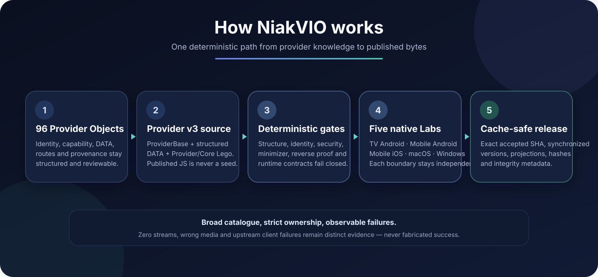

<div align="center">
  

  <p><strong>English</strong> · <a href="README.fr.md">Français</a></p>
  <h3>One maintained provider layer for Nuvio.</h3>
  <p><strong>46 Hub Provider Objects · VO / VF · TV / Mobile / Desktop</strong></p>
  <p>One provider layer, multiple manifest projections, structured provider knowledge and native validation across the official Nuvio clients.</p>
</div>

---

## Install NiakVIO

Pick the projection that matches your setup and paste its URL into Nuvio.

**Recommended — general manifest**

```text
https://raw.githubusercontent.com/niakw/NiakVIO/refs/heads/main/manifest.json
```

**French-focused manifest**

```text
https://raw.githubusercontent.com/niakw/NiakVIO/refs/heads/main/vf/manifest.json
```

**General manifest without anime-oriented providers**

```text
https://raw.githubusercontent.com/niakw/NiakVIO/refs/heads/main/no-anime/manifest.json
```

**French-focused manifest without anime-oriented providers**

```text
https://raw.githubusercontent.com/niakw/NiakVIO/refs/heads/main/vf-no-anime/manifest.json
```

Manifest guide: [`docs/how-to-add-manifest.md`](docs/how-to-add-manifest.md)

### StreamBadge feed

```text
https://raw.githubusercontent.com/niakw/NiakVIO/main/assets/stream-badges-fusion-v2.json
```

StreamBadge guide: [`docs/how-to-add-stream-badges.md`](docs/how-to-add-stream-badges.md)

> NiakVIO does not host video. It maintains provider metadata, structured protocol knowledge, compatibility rules, manifests and client-side provider bundles.

> [!IMPORTANT]
> Named works in code, CI or documentation are deterministic **test fixtures**, not a catalogue. See [`TESTING_NOTICE.md`](TESTING_NOTICE.md) and [`DISCLAIMER.md`](DISCLAIMER.md).

---

## Why NiakVIO?

A provider pack is easy while everything is static. The maintenance problem starts when domains rotate, APIs change, player requirements drift, native clients behave differently, or cached provider generations refuse to refresh.

NiakVIO is built around that lifecycle rather than around a one-time bundle dump.

| | NiakVIO keeps this explicit |
| --- | --- |
| **Catalogue** | 46 Hub Provider Objects stay in the census; disabled or unresolved providers are not silently deleted to improve a success rate. |
| **Projections** | General, French-focused and no-anime manifests are generated from one maintained provider layer. |
| **Provider knowledge** | Routes, request semantics, identity rules, official-domain evidence and provenance live outside opaque published bundles. |
| **Repair** | Common failures can be handled at Provider/Core-family level; uncertain changes go through reviewable Learning proposals. |
| **Native evidence** | TV Android, Mobile Android, Mobile iOS, macOS and Windows are independent compatibility boundaries. |
| **Publication** | Provider versions, manifest versions, content-addressed bundles and integrity metadata stay synchronized. |
| **Validation** | Zero streams, wrong-media playback, malformed media and upstream client failures remain distinct states instead of fake success. |

<div align="center">
  
</div>

---

## Recommended Nuvio setup

<div align="center">
  <a href="https://github.com/NuvioMedia"></a>
  <p><strong>Keep the stack small: one tool per role.</strong></p>
  <p>NiakVIO is designed to be the provider layer, not to replace every other part of the Nuvio stack.</p>
</div>

| Role | Recommended project | What it should do in the stack | Links |
| --- | --- | --- | --- |
| **Providers** | <br>**NiakVIO** | Use **one NiakVIO manifest** as the provider layer. Keeping this role singular makes source selection, caching and provider diagnostics much easier to understand. | [Repository](https://github.com/niakw/NiakVIO) · [General manifest](https://raw.githubusercontent.com/niakw/NiakVIO/refs/heads/main/manifest.json) |
| **Metadata & catalogue** | <br>**Ultra MAX** | Use it for catalogues, metadata-oriented rows and discovery instead of stacking another provider pack on top of NiakVIO. | [Ultra MAX](https://ultramax.vip) · [GitHub](https://github.com/PaRaN01a-hash/UltraMax) |
| **Subtitles** | <br>**SubSense** | Keep subtitle discovery in a dedicated addon rather than mixing subtitle responsibilities into the provider layer. | [Configure](https://subsense.nepiraw.com/configure) · [GitHub](https://github.com/NepiRaw/Stremio-SubSense) |
| **Favorites & tracking** | <br>**SIMKL** | Use it for watch history, favorites and tracking so playback/provider concerns stay separate from user-library state. | [SIMKL](https://simkl.com) |

> [!TIP]
> **Simple target stack:** 1 provider layer + 1 metadata/catalogue addon + 1 subtitle addon + 1 tracking service. Avoid installing several provider packs that compete for the same role unless you are deliberately testing them.

---

## NiakVIO vs a raw provider manifest

A standalone provider or manifest can be perfectly useful. NiakVIO becomes valuable when the objective is a **large, changing provider catalogue that must remain maintainable across multiple Nuvio clients**.

| Capability | Raw provider / standalone manifest | NiakVIO |
| --- | --- | --- |
| Installation | One or several provider manifests | One stable provider layer with general/VF projections |
| Catalogue maintenance | Mostly manual | 46 Hub Provider Objects retained and audited |
| Durable source | Often the published JS itself | ProviderBase v3 + structured DATA + owned Provider/Core Lego |
| Route knowledge | Usually embedded in provider code | Structured route/request/provenance data |
| Domain rotation | Manual/static URL changes | Official-hub discovery + bounded `official_site` refresh |
| Media types | Launch type and semantic capability can be mixed | Canonical capability separated from Nuvio transport compatibility |
| Failure diagnosis | Often zero streams / generic error | Search, detail, episode, runtime, player, media and device evidence |
| Repair | Manual provider rewrite | Family/Core repair + reviewable Learning proposals |
| Client coverage | Often inferred from one runtime | Five independent native Labs |
| Publication | File replacement | Cache-safe provider versions + manifest generation + integrity hashes |
| Security | Source-dependent | Bounded execution, network/resource guards and sanitization contracts |

---

## Built for the official Nuvio clients

NiakVIO treats every official client/device as its own compatibility boundary:

- **TV Android** — [NuvioTV](https://github.com/NuvioMedia/NuvioTV)
- **Mobile Android** — [NuvioMobile](https://github.com/NuvioMedia/NuvioMobile)
- **Mobile iOS** — [NuvioMobile](https://github.com/NuvioMedia/NuvioMobile)
- **Desktop macOS** — [NuvioDesktop](https://github.com/NuvioMedia/NuvioDesktop)
- **Desktop Windows** — [NuvioDesktop](https://github.com/NuvioMedia/NuvioDesktop)

A Desktop result does not automatically count as Android/iOS/TV evidence. Labs consume official clients as-is: an upstream compile, dependency, packaging, runtime, player or QuickJS failure stays visible instead of being patched inside NiakVIO merely to manufacture green CI.

<!-- NIAKVIO_NATIVE_ADAPTIVE_LAB_DOCS_V1 -->
### Native acceptance scope and adaptive sampling

The maintained catalogue remains **46 Hub Provider Objects**. Final native acceptance uses the explicit physical **Hub-46** scope from `automation/evidence/hub-lab-matrix-46.json`; disabled or out-of-scope catalogue rows remain visible maintenance debt and are not silently deleted.

The ordinary Lab corpus is not a fixed batch. `.github/triggers/rotating-popular-corpus.json` owns exactly three recent global reserves — **movie, TV and anime** — currently 32 works per lane, constrained to 2010 through the previous calendar year. A native campaign starts with exactly **1 movie + 1 TV episode + 1 anime episode**. A provider/lane advances to another work from the same reserve only after a clean `0 streams` result. Positive proof stops rotation; runtime/load/timeout/transport/player/identity failures stop and remain visible instead of being rotated away.

Historical fixtures in `.github/triggers/nuvio-client-lab.json` remain available for targeted regression diagnostics, but they are not the ordinary global sampling authority.

---

## Under the hood

### Provider v3

Provider bundles are reconstructed from:

```text
ProviderBase v3
+ structured provider DATA/static knowledge
+ PROVIDER.* Lego
+ CORE.* Lego
+ NiakVIO-safe minimizer
```

Published `providers/*.js` files are content-addressed runtime artifacts, **never reconstruction seeds**. Historical/upstream JavaScript is knowledge and provenance only.

Canonical ownership uses managed `STARTFIX` / `CLOSEFIX` / `FIXDATA` boundaries and one global Core boundary. Full reconstruction must finish with a byte-identical reverse rebuild. Terser is forbidden; `scripts/provider_v3_minimizer.py` is deliberately conservative and runs before content hashing.

See [`ARCHITECTURE.md`](ARCHITECTURE.md).

### Route and protocol DATA

The durable source is:

```text
provider.model.routeData
```

Route recognition preserves, when known, method, body encoding and fields, `Referer`, `Origin`, response kind, placeholders, role, provenance and confidence. Static analysis can recover variables, concatenations and templates without treating the published provider bundle as reconstruction authority.

Missing route evidence means **unknown**, not automatically dead or quarantined.

### Media types: semantic capability vs Nuvio transport

`canonicalSupportedTypes` describes what the provider catalogue actually serves (`movie`, `tv`, `anime`). `supportedTypes` describes how Nuvio may launch it.

An anime-only provider can therefore legitimately expose:

```json
{
  "canonicalSupportedTypes": ["anime"],
  "supportedTypes": ["anime", "tv"]
}
```

`tv` is the episodic launch-compatibility alias for anime. NiakVIO does not synthesize `series`; `movie` appears only when the provider declares canonical movie capability. Transport aliases never widen semantic capability.

### Runtime rules

Provider JS is a specialized reader, not a crawler or Learning engine.

- capability/type gate before provider network work;
- TMDB enrichment only when the provider plan needs it;
- identity scoped by work/type/season/episode;
- incompatible provider returns `[]` instead of arbitrary searching;
- Core output processing runs only after useful streams exist;
- zero streams never manufacture success;
- wrong-media playback is a failure;
- one broken stream never disables the whole provider by itself.

### Reader, transport and playback

A `.m3u8` URL or `#EXTM3U` response does not prove native playback. NiakVIO separates extraction, identity, request context, playlist/variant resolution, media/container integrity and the actual native player outcome.

HTML/JSON disguised as media or positively malformed TS/fMP4 can be rejected. A timeout, temporary fetch failure, encrypted stream or unavailable diagnostic byte API is **inconclusive**, not evidence for a fabricated provider-wide failure.

---

## CORE, Learning and Domain Refresh

`CORE - Verify & Publish` is the routine publication workflow.

- **Quick** — deterministic structure/runtime/unit/security/minimizer checks. No provider repair or reconstruction.
- **Deep** — broader read-only network/hub observation, provider-health evidence, projections, reports and integrity inventories. Still no Provider JS repair/reconstruction.
- **Learning** — isolated code-evolution/repair path. Proposed changes remain reviewable before publication authority.
- **Domain Refresh** — deliberately narrow maintenance of validated `official_site` CONFIG data only.

This separation prevents a health check from silently rewriting a provider just because a site is temporarily unavailable.

---

## Publication and versioning

Publication is atomic and fail-closed. Published provider-byte changes require synchronized provider/manifest/cache/release metadata, but **the bump happens only after the validation pile is accepted**.

The accepted release is finalized explicitly through `release-finalize.yml`. It checks out and enforces the exact accepted `expected_sha`, exports the current release-generation baseline, reapplies durable patches to the 46 current providers, drives the NiakVIO minimizer to a verified fixed point, rebuilds projections, synchronizes provider/manifest/cache/release versions, then rebuilds the pinned Hub-46 transport and integrity hashes. The locally staged generation is published only by compare-and-swap if `main` has not moved. This is bounded release rematerialization, not discovery, Learning or full provider reconstruction.

Route-only census, documentation and workflow-only changes that do not alter published provider bytes do **not** trigger a provider/cache bump. `sync.yml` Quick/Deep remains validation-oriented and does not routinely mutate release versions.

Final publication can include:

- `provider_catalog.json`;
- content-addressed provider bundles;
- `manifest.json` and VF/no-anime projections;
- provenance/domain state;
- synchronized provider/cache/release versions;
- release hashes and allowlisted reports.

---

## Main workflows

| Workflow | Responsibility |
| --- | --- |
| `sync.yml` | **CORE - Verify & Publish** Quick/Deep; no provider repair/reconstruction or routine release bump |
| `release-finalize.yml` | exact-SHA accepted-release finalization: synchronized versions, projections, hashes and integrity |
| `provider-v3-reconstruct-routes.yml` | route-only recognition / canonical `routeData` census |
| `provider-v3-reconstruct-all.yml` | full Provider v3 reconstruction + reverse byte proof |
| `brain-learning-lab.yml` | sandbox observation/repair Learning + reviewable proposals |
| `domain-refresh.yml` | validated `official_site` CONFIG-only maintenance |
| `add-provider.yml` | structured provider onboarding |
| `native-mobile-android-reader.yml` | TV Android + Mobile Android evidence |
| `native-mobile-ios-reader.yml` | Mobile iOS evidence |
| `native-desktop-reader-acceptance.yml` | Desktop macOS + Windows evidence |
| `native-corpus-device-targeted.yml` | targeted device/provider diagnostics |
| `github-actions-gate.yml` | workflow/repository security and compatibility invariants |
| `codeql.yml` | local CodeQL `security-extended` evidence + High/Critical production dependency audit |
| `weekly-upstream-provider-discovery.yml` | read-only upstream discovery |
| `purge-actions-history.yml` | old Actions-run cleanup |
| `brain-branch-maintenance.yml` | Learning/proposals store maintenance |

---

## Upstream references & credits

> [!NOTE]
> NiakVIO is an independent project. Upstream repositories are used as **knowledge, implementation evidence and provenance**. They do not become NiakVIO reconstruction authorities, and published upstream JavaScript is never treated as the canonical source for rebuilding NiakVIO providers.

| Project | What it contributes | Relationship to NiakVIO |
| --- | --- | --- |
| [](https://github.com/Gowaru/gowaru-nuvio-providers)<br>**[Gowaru](https://github.com/Gowaru/gowaru-nuvio-providers)** | French Nuvio provider implementations and provider-local protocol knowledge. Useful for route semantics, request behavior and provenance cross-checks. | **Reference / evidence source** — not reconstruction authority. |
| [](https://github.com/yoruix/nuvio-providers)<br>**[Yoru](https://github.com/yoruix/nuvio-providers)** | Provider implementations and reusable Nuvio conventions that help cross-check runtime behavior and interfaces. | **Reference / evidence source** — not reconstruction authority. |
| [](https://github.com/D3adlyRocket/All-in-One-Nuvio)<br>**[All-in-One Nuvio / D3adlyRocket](https://github.com/D3adlyRocket/All-in-One-Nuvio)** | Historical provider aggregation and mirror material that can preserve useful provenance when original implementations move or disappear. | **Historical provenance source** — never canonical NiakVIO provider source. |

### What “upstream knowledge” means here

NiakVIO may use an upstream project to learn or verify:

- endpoint and route structure;
- request methods, headers, body encoding and response shapes;
- provider naming, provenance and historical behavior;
- runtime conventions or compatibility patterns worth cross-checking.

That knowledge is normalized into NiakVIO's own structured DATA / Provider/Core model before publication. The goal is to preserve credit and evidence **without making third-party published bundles the durable source of truth**.

---

## Security, responsibility and independence

Provider JavaScript is treated as untrusted input. NiakVIO uses bounded workers, SSRF/network controls, sandboxing, identity checks, CI sanitization and fail-closed publication. Generic regex-based HTML stripping is forbidden by the Provider v3 security contract.

NiakVIO is an independent community project and is not affiliated with Nuvio or referenced third-party services. Nothing in this repository grants rights to third-party media/services or authorizes bypassing authentication, paywalls, encryption or access controls.

See [`SECURITY.md`](SECURITY.md), [`TESTING_NOTICE.md`](TESTING_NOTICE.md), [`DISCLAIMER.md`](DISCLAIMER.md), [`LICENSE`](LICENSE), [`NOTICE`](NOTICE), [`CONTRIBUTING.md`](CONTRIBUTING.md) and [`CODE_OF_CONDUCT.md`](CODE_OF_CONDUCT.md).
