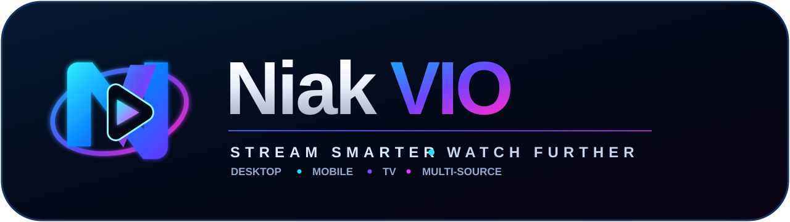

<div align="center">
  

  <p><strong>English</strong> · <a href="README.fr.md">Français</a></p>
  <p><strong>A community engine that aggregates, tests, repairs and maintains Nuvio providers.</strong></p>
  <p>VO · VF &nbsp;•&nbsp; Mobile · Desktop · TV</p>
</div>

---

## Add NiakVIO to Nuvio

### General manifest — recommended ([How to add?](docs/how-to-add-manifest.md))

```text
https://raw.githubusercontent.com/niakw/NiakVIO/refs/heads/main/manifest.json
```

### French-focused manifest ([How to add?](docs/how-to-add-manifest.md))

```text
https://raw.githubusercontent.com/niakw/NiakVIO/refs/heads/main/vf/manifest.json
```

### General manifest — without anime providers ([How to add?](docs/how-to-add-manifest.md))

Copy of the general catalogue excluding providers that either declare **anime as their only supported type**, or whose committed provider id/name contains **`anim`** (case-insensitive). Mixed movie/TV/anime providers stay when their identity is not anime-oriented.

```text
https://raw.githubusercontent.com/niakw/NiakVIO/refs/heads/main/no-anime/manifest.json
```

### French-focused manifest — without anime providers ([How to add?](docs/how-to-add-manifest.md))

The same deterministic anime filter applied to the French-focused projection.

```text
https://raw.githubusercontent.com/niakw/NiakVIO/refs/heads/main/vf-no-anime/manifest.json
```

### StreamBadge feed — recommended ([How to add?](docs/how-to-add-stream-badges.md))

```text
https://raw.githubusercontent.com/niakw/NiakVIO/main/assets/stream-badges-fusion-v2.json
```

Dark and light feeds are also available under `assets/`.

> NiakVIO does not store or host video. It maintains manifests, metadata, compatibility rules and provider bundles consumed client-side.

> [!IMPORTANT]
> **Work references are test fixtures.** Titles, years, seasons and episodes visible in the README, source code, CI logs or artifacts are deterministic **test identifiers** used to verify matching, compatibility and wrong-media regressions. They are not a content catalogue, an offer, an endorsement or a statement about third-party rights/licensing. NiakVIO must not publish media files, clips, subtitle payloads, decryption keys, access tokens or complete playback URLs. **Copyright exceptions and limitations differ by jurisdiction; NiakVIO does not assume that fair use, fair dealing, research/testing or any other exception applies, and grants no right to access or use third-party material.** See [`TESTING_NOTICE.md`](TESTING_NOTICE.md) and [`DISCLAIMER.md`](DISCLAIMER.md).

---

## Why NiakVIO?

Providers can break because of domain moves, API changes, player changes, expired runtime assumptions or client differences.

NiakVIO adds a maintenance layer between upstream provider repositories and Nuvio:

- one installation point;
- multiple upstream repositories observed with one deterministic canonical input retained before Health/Repair;
- bounded automated repair;
- final-media validation rather than URL-only checks;
- title/year/season/episode identity validation;
- explicit Mobile, Desktop and TV evidence;
- last-known-good preservation;
- atomic fail-closed publication.

The objective is not to publish the largest possible provider count. It is to publish useful providers with enough evidence to understand why they work or fail.

---

## Official Nuvio clients

- [Nuvio Mobile](https://github.com/NuvioMedia/NuvioMobile)
- [Nuvio Desktop](https://github.com/NuvioMedia/NuvioDesktop)
- [NuvioTV](https://github.com/NuvioMedia/NuvioTV)

NiakVIO audits the current official client HEADs and treats each client as a separate compatibility boundary. Desktop evidence never automatically counts as Mobile or TV evidence.

---

## Provider v3 architecture

NiakVIO's executable provider source is **ProviderBase v3 + structured DATA/static knowledge + owned Lego + the NiakVIO-safe minimizer**. Published `providers/*.js` files are generated, content-addressed client artifacts and are never reused as reconstruction seeds.

The canonical Provider JS envelope is:

```text
BEGIN NIAKVIO_PROVIDER
  ProviderBase v3
  PROVIDER.<ID>.CONFIG.V1  (STARTFIX / FIXDATA / CLOSEFIX)
  optional PROVIDER.* Lego
  NUVIO_GLOBAL_CORE_START_BOUNDARY_V1
  CORE.* Lego             (STARTFIX / CLOSEFIX)
END NIAKVIO_PROVIDER
```

The forced 96/96 reconstruction lives only in `.github/workflows/provider-v3-reconstruct-all.yml`. It requires the full strategy/plan contract (`91` executable non-quarantined + `5` explicit quarantines at the retry-25 reference), minimizer/security gates and a byte-identical reverse rebuild. Upstream code is knowledge/provenance, not executable canonical source.

Terser is forbidden. `scripts/provider_v3_minimizer.py` runs before content hashing and only removes leading indentation on lines proven to begin in ordinary JavaScript code state; it preserves every line terminator, managed marker, literal and expression.

See [`ARCHITECTURE.md`](ARCHITECTURE.md) for the full contract.

## CORE Quick and Deep

The routine workflow is [`.github/workflows/sync.yml`](.github/workflows/sync.yml), displayed as **CORE - Verify & Publish**.

**Quick** is a fast deterministic safety gate over the exact Provider v3 bytes. It performs no provider repair, reconstruction or code/DATA mutation and does not run full network health.

**Deep** adds structural and network observation, reprojects manifests and regenerates reports/hashes. It still performs no provider repair or reconstruction; on `main`, its write scope is restricted to approved reports, projections and integrity inventories.

Code evolution belongs to the independent Learning sandbox and reviewable proposals. Domain Refresh is separately limited to validated `official_site` CONFIG DATA updates.

---

## Native Labs

NiakVIO validates real paths on official Nuvio clients:

- NuvioTV on Android TV;
- Nuvio Mobile on Android;
- Nuvio Mobile on iOS simulator through the official iOS plugin runtime and production MPV bridge;
- Nuvio Desktop on native macOS and Windows.

The Labs distinguish provider extraction problems, runtime errors, player/client incompatibility, transport failures, missing media and wrong-media identity.

Canonical acceptance is exactly **five first-class Labs**: TV Android, Mobile Android, Mobile iOS, Desktop macOS and Desktop Windows. The final matrix covers **96 providers / 214 declared routes** (`82 movie + 92 tv + 40 anime`), with disabled providers still audited. The representative fixtures are Interstellar, Breaking Bad S01E01 and Jujutsu Kaisen S01E01. Labs are observational: they consume exact Provider JS bytes and never repair, reconstruct or mutate them.

Named movies, series and anime in Lab configurations are **test fixtures**, not catalogue entries. Public evidence is intentionally minimized and sanitized. See [`TESTING_NOTICE.md`](TESTING_NOTICE.md).

---

## Repair Brain and Learning

The Brain classifies failures before attempting repair. It can reason about search, catalogue, episode, player, extraction, transport, playback context, identity and client-contract failures.

Learning runs in a sandbox and can preserve successful/failed strategies across runs. During learning it may additionally run one **bounded targeted client Lab** against a single provider: the fixture is chosen from the provider's first declared media type (`movie`, `tv` or `anime`), with only sanitized verdict/identity/stream-count evidence fed back into learning. This is deliberately much smaller than a full native device matrix.

Production code is not silently rewritten from learning state; validated automated proposals remain review-gated.

---

## Publication and integrity

Publication is atomic and fail-closed and can include:

- `provider_catalog.json`;
- provider bundles;
- `manifest.json`;
- `vf/manifest.json`;
- `no-anime/manifest.json`;
- `vf-no-anime/manifest.json`;
- provenance;
- domain/LKG state;
- release hashes.

Inconsistent generations must not silently replace a previously healthy published state.

---

## Main workflows

| Workflow | Purpose |
|---|---|
| `sync.yml` | **CORE - Verify & Publish**: Quick/Deep verification; no provider repair/reconstruction |
| `provider-v3-reconstruct-all.yml` | manual 96/96 Provider v3 reconstruction on a non-main branch + reverse byte proof |
| `brain-learning-lab.yml` | independent sandbox observation/repair learning + reviewable proposals |
| `domain-refresh.yml` | validated `official_site` CONFIG-only maintenance |
| `add-provider.yml` | structured provider onboarding; activation still requires evidence |
| `native-mobile-android-reader.yml` | official NuvioTV Android TV + NuvioMobile Android evidence |
| `native-mobile-ios-reader.yml` | official NuvioMobile iOS evidence |
| `native-desktop-reader-acceptance.yml` | official NuvioDesktop macOS + Windows evidence |
| `native-corpus-device-targeted.yml` | manual targeted device/provider diagnostics |
| `native-reader-learning-sync.yml` | import sanitized reader evidence into Learning memory |
| `github-actions-gate.yml` | workflow/dependency security invariants |
| `codeql.yml` | CodeQL analysis |
| `external-code-audit.yml` | SonarQube Cloud / DeepSource / CodeScene evidence |
| `weekly-upstream-provider-discovery.yml` | read-only upstream discovery |
| `purge-actions-history.yml` | cleanup of old completed Actions runs |

---

## Repository policy

- `main` is the only production code branch;
- Labs use exact `main` SHAs;
- `brain-learning/proposals` stores sanitized learning memory only and is automatically rebased onto the current `main`;
- `brain-repair/proposal` is ephemeral and is removed when no Brain PR is open;
- automated Brain repair proposals require human review/merge;
- official Nuvio repositories are consumed read-only.

---

## International / jurisdiction-specific use

Copyright, related-rights, database, contract and technological-protection rules vary by country. NiakVIO's documentation does not choose or presume a copyright exception for users worldwide.

The repository follows a conservative technical policy: minimize persisted evidence, prefer metadata or lawful public previews/trailers when they can prove the same assertion, do not publish complete playback URLs or protected payloads, and never treat a successful test as proof of authorization.

Nothing in this repository grants a licence, waives third-party rights, authorizes circumvention of authentication, paywalls, access controls, encryption or technological protection measures, or authorizes conduct prohibited by applicable law or binding service terms. Users and contributors are responsible for the rules that apply where they act.

---

## Security, responsibility and independence

Provider JavaScript is treated as untrusted input. NiakVIO applies bounded workers, network/SSRF controls, provider sandbox hardening, identity checks, CI sanitization and fail-closed publication.

NiakVIO is an independent community project and is not affiliated with Nuvio or referenced third-party services. It does not determine the legal status, rights or authorization of third-party content/services. Use must comply with applicable law, third-party rights and relevant service terms.

See [`TESTING_NOTICE.md`](TESTING_NOTICE.md), [`DISCLAIMER.md`](DISCLAIMER.md), [`LICENSE`](LICENSE), [`NOTICE`](NOTICE), [`SECURITY.md`](SECURITY.md), [`CONTRIBUTING.md`](CONTRIBUTING.md) and [`CODE_OF_CONDUCT.md`](CODE_OF_CONDUCT.md).
