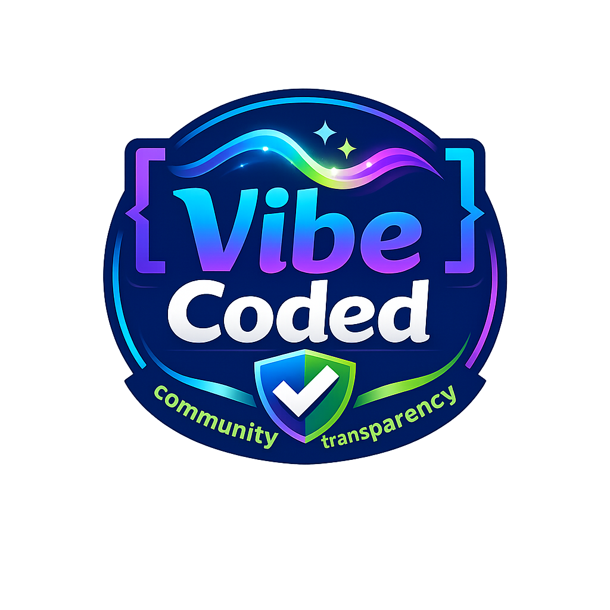
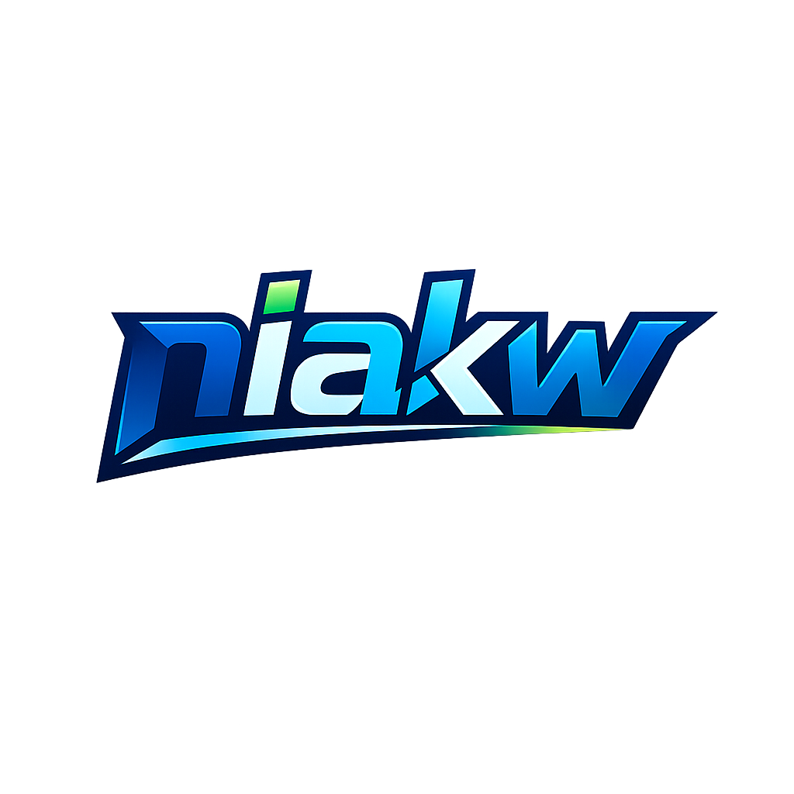

<div align="center">
  

# Niakvio

**Plugin communautaire pour Nuvio regroupant des providers VO, VF et VOSTFR dans des manifests unifiés, réparés, testés et publiés avec des contrôles de compatibilité, de sécurité et d’intégrité.**

[](#installation)
[](package.json)
[](LICENSE)
[](#compatibilit%C3%A9-nuvio)

</div>

---

## Manifests Niakvio

### Manifest général — recommandé

**VF + VOSTFR + VO + autres langues**

```text
https://raw.githubusercontent.com/niakw/Niakvio/refs/heads/main/manifest.json
```

[Ouvrir le manifest général](https://raw.githubusercontent.com/niakw/Niakvio/refs/heads/main/manifest.json)

### Manifest francophone

**Projection dédiée aux providers proposant du contenu français ou sous-titré français.**

```text
https://raw.githubusercontent.com/niakw/Niakvio/refs/heads/main/vf/manifest.json
```

[Ouvrir le manifest francophone](https://raw.githubusercontent.com/niakw/Niakvio/refs/heads/main/vf/manifest.json)

> Les URL des manifests restent stables. Les versions, bundles, états d’activation, domaines et règles de compatibilité évoluent derrière ces URL.

---

## Installation

1. Copiez l’URL du manifest souhaité.
2. Ouvrez **Nuvio**.
3. Accédez à **Plugins / Providers**.
4. Ajoutez ou importez l’URL.
5. Utilisez ensuite l’actualisation du plugin pour récupérer les nouvelles versions.

Lorsqu’un provider est réactivé après une correction, Niakvio peut réviser son identifiant client interne afin d’éviter qu’un ancien état mis en cache par Nuvio conserve artificiellement le provider désactivé.

---

## Compatibilité Nuvio

Niakvio tient maintenant compte explicitement des plateformes utilisées par les clients Nuvio.

| Plateforme | Famille runtime contrôlée | Filtrage manifest |
|---|---|---|
| Android | Nuvio Mobile / QuickJS | `android` |
| iOS | Nuvio Mobile / QuickJS | `ios` |
| Windows | Nuvio Desktop / QuickJS JVM | `desktop`, `jvm`, `windows` |
| macOS | Nuvio Desktop / QuickJS JVM | `desktop`, `jvm`, `macos` |
| Linux | Nuvio Desktop / QuickJS JVM | `desktop`, `jvm`, `linux` |

Les clients Mobile et Desktop actuels utilisent le contrat plugin positionnel :

```text
getStreams(tmdbId, mediaType, season, episode)
```

Niakvio reproduit ce contrat dans ses probes afin d’éviter qu’un fallback propre au banc de test rende artificiellement compatible un provider qui ne le serait pas dans Nuvio.

### Politique de compatibilité

Depuis la branche de publication 5.20.28, un provider n’est **pas** déclaré incompatible simplement parce qu’un titre de test retourne zéro résultat.

La décision distingue :

- **compatible direct** : un média HLS, DASH ou conteneur directement lisible a été prouvé ;
- **inconclusif** : aucune preuve positive, mais aucune incompatibilité concluante non plus ; le provider reste disponible ;
- **incompatible concluante** : runtime cassé ou payload retourné de façon répétée mais non lisible comme média ; le provider peut alors être masqué uniquement sur la famille de plateformes concernée.

Cette règle évite deux erreurs opposées : conserver des providers qui apparaissent mais ne peuvent pas être lus, ou désactiver des providers fonctionnels uniquement parce que deux œuvres représentatives ne sont pas présentes dans leur catalogue.

Les règles finales sont contrôlées simultanément dans [`manifest.json`](manifest.json) et [`vf/manifest.json`](vf/manifest.json).

> La matrice CI reproduit les contrats runtime et vérifie les payloads réseau. Elle ne prétend pas remplacer un test manuel sur chaque modèle physique de téléphone ou d’ordinateur.

---

## À quoi sert Niakvio ?

Niakvio n’est plus un simple agrégateur de fichiers JavaScript. Le dépôt ajoute une couche de sélection, réparation, validation, compatibilité et publication autour de plusieurs projets communautaires de providers Nuvio.

Le projet peut notamment :

- collecter plusieurs variantes d’un même provider ;
- éliminer les doublons et variantes obsolètes ;
- exclure les protocoles torrent, magnet, Acestream et autres chemins P2P ;
- résoudre les changements de domaine depuis des hubs ou adresses officielles ;
- distinguer un hub d’information d’un véritable domaine terminal utilisable ;
- détecter des routes API, recherche ou catalogue devenues obsolètes ;
- appliquer des correctifs partagés et versionnés aux bundles ;
- restaurer un dernier bundle connu comme sain lorsqu’un upstream est incomplet ou corrompu ;
- exécuter les providers dans un worker borné et isolé ;
- vérifier que les résultats retournés correspondent réellement à du média ;
- rejeter les faux HLS, previews courtes, pages HTML et lecteurs parasites ;
- conserver séparément les preuves par catégorie, runtime et génération de bundle ;
- synchroniser le manifest général avec sa projection francophone ;
- publier uniquement une release dont les versions et empreintes sont cohérentes.

```text
Sources communautaires
        ↓
Collecte et déduplication des variantes
        ↓
DNS / hubs officiels / domaines terminaux
        ↓
Accès provider et routes réelles
        ↓
Diagnostic runtime
        ↓
Réparation bornée si nécessaire
        ↓
Validation des streams et payloads
        ↓
Compatibilité Android / iOS / Desktop
        ↓
Sélection et activation fondées sur les preuves
        ↓
Projection VF
        ↓
Synchronisation de version + hashes + intégrité
        ↓
Publication des manifests Niakvio
```

**Niakvio ne stocke aucune vidéo.** Le dépôt publie uniquement des manifests, métadonnées, correctifs et bundles de providers exécutés côté client Nuvio.

---

## Validation des providers

### 1. DNS et domaine

Avant d’interpréter une erreur comme une panne du provider, Niakvio vérifie le domaine et son rôle.

La récupération peut s’appuyer sur :

- le registre de hubs officiels ;
- les redirections publiques ;
- des pages officielles d’adresses ;
- l’historique de domaines précédemment validés ;
- des candidats de récupération strictement bornés.

Une nouvelle adresse n’est pas promue uniquement parce qu’elle répond en HTTP : son rôle et sa compatibilité avec le provider doivent être cohérents.

### 2. Accès et catégorie

Les catégories sont traitées explicitement :

- `movie` pour les films ;
- `tv` pour les séries ;
- `anime` lorsque le provider expose une logique animation dédiée.

Un provider peut donc fonctionner sur une catégorie et échouer sur une autre. Niakvio évite autant que possible de transformer une réussite représentative sur une catégorie en preuve universelle pour toutes les autres.

### 3. Runtime réel

Le worker reproduit les signatures d’appel utilisées par Nuvio et limite :

- le nombre de requêtes ;
- les redirections ;
- le volume des réponses ;
- le nombre d’hôtes distincts ;
- la durée d’exécution.

Les erreurs structurées sont conservées afin de distinguer une panne réseau, une erreur d’invocation, une route disparue, un catalogue vide ou une extraction cassée.

### 4. Stream réellement lisible

Une URL retournée ne suffit pas.

Niakvio inspecte notamment :

- le statut HTTP ;
- le type de contenu ;
- la présence d’un véritable manifest `#EXTM3U` pour HLS ;
- les manifests DASH ;
- les signatures de conteneurs MP4 / Matroska / WebM / MPEG-TS ;
- les pages HTML ou JSON présentées à tort comme un média ;
- les previews anormalement courtes ;
- les hôtes ou routes explicitement bloqués.

### 5. Réparation et comparaison

Une réparation n’est conservée que si elle améliore réellement le comportement observé.

Le pipeline peut :

1. exécuter le bundle d’origine ;
2. identifier une classe de panne ;
3. appliquer un correctif borné ;
4. retester exactement le bundle modifié ;
5. comparer le résultat avec le parent ;
6. rejeter les réparations neutres, régressives ou purement cosmétiques.

Les correctifs comportementaux sont factorisés autant que possible sous forme de profils réutilisables plutôt que dupliqués provider par provider.

### 6. Activation et last-known-good

Un historique positif peut aider à préserver un provider lorsque le runner CI rencontre une situation inconclusive, mais il ne doit pas fabriquer une preuve actuelle inexistante.

Les mécanismes de dernier état sain servent principalement à empêcher une panne temporaire de l’upstream ou du runner de détruire inutilement un bundle déjà validé.

---

## Sécurité réseau et sandbox

Les providers sont du code tiers. Niakvio applique donc plusieurs protections avant et pendant les probes :

- blocage des destinations locales, privées et metadata ;
- protection contre certains scénarios de DNS rebinding ;
- validation manuelle des redirections par le garde réseau ;
- quotas de requêtes, taille et hôtes ;
- environnement d’exécution contraint ;
- contrôle des sorties provider ;
- refus des protocoles P2P dans les manifests publiés ;
- tests de non-régression du worker et du garde réseau.

Voir [`SECURITY.md`](SECURITY.md) pour les règles détaillées.

---

## Manifests général et VF

Le manifest VF n’est pas maintenu comme un projet indépendant : il est une **projection contrôlée** du manifest général.

La validation vérifie notamment :

- les identifiants providers ;
- l’état `enabled` ;
- les catégories `supportedTypes` ;
- le bundle réellement référencé ;
- les règles `supportedPlatforms` / `disabledPlatforms` ;
- les chemins `providers/...` et `../providers/...` ;
- l’alignement de version entre les deux manifests.

Une divergence involontaire entre les deux publications fait échouer la validation.

---

## Intégrité des releases

Une publication Niakvio ne se limite pas à modifier `manifest.json`.

Le pipeline synchronise la version entre :

- [`package.json`](package.json) ;
- [`package-lock.json`](package-lock.json) ;
- [`manifest.json`](manifest.json) ;
- [`vf/manifest.json`](vf/manifest.json) ;
- [`sources.json`](sources.json).

Les fichiers durables de la release sont ensuite inventoriés par SHA-256.

| Ressource | Rôle |
|---|---|
| [`SHA256SUMS.json`](SHA256SUMS.json) | Empreintes des fichiers cœur de la release |
| [`FILE-HASHES.json`](FILE-HASHES.json) | Inventaire étendu des fichiers publiés |
| [`PATCH-SHA256SUMS.txt`](PATCH-SHA256SUMS.txt) | Inventaire déterministe utilisé pour contrôler l’arbre publié |
| [`PROVENANCE.json`](PROVENANCE.json) | Origine et traçabilité des bundles |

Les GitHub Actions sensibles sont également référencées par SHA immuable. Le pipeline final peut régénérer les hashes après publication et exiger un arbre sans différence afin d’éviter qu’une release annoncée valide diffère réellement des fichiers présents sur `main`.

---

## Matrice de compatibilité runtime

Les fichiers suivants rendent la logique de plateforme inspectable dans le dépôt :

| Fichier | Description |
|---|---|
| [`automation/platform-runtime-contracts.json`](automation/platform-runtime-contracts.json) | Contrats et tokens des clients Android, iOS, Windows, macOS et Linux |
| [`automation/platform-runtime-matrix.json`](automation/platform-runtime-matrix.json) | Résultats du dernier probe multi-runtime publié |
| [`automation/platform-runtime-policy.json`](automation/platform-runtime-policy.json) | Décisions de visibilité par plateforme issues de la matrice |

Ces fichiers font partie du périmètre d’intégrité de la release.

---

## Rapports et fichiers utiles

| Ressource | Description |
|---|---|
| [`manifest.json`](manifest.json) | Manifest général Niakvio |
| [`vf/manifest.json`](vf/manifest.json) | Manifest francophone |
| [`health-report.json`](health-report.json) | Résultat du dernier contrôle de santé |
| [`availability-report.json`](availability-report.json) | État d’accessibilité observé |
| [`repair-report.json`](repair-report.json) | Réparations testées et décisions associées |
| [`provider-hubs.json`](provider-hubs.json) | Registre des hubs et domaines officiels |
| [`provider-overrides.json`](provider-overrides.json) | Overrides durables de domaine, route, patch et manifest |
| [`PROVENANCE.json`](PROVENANCE.json) | Origine des bundles publiés |
| [`SHA256SUMS.json`](SHA256SUMS.json) | Hashes cœur de release |
| [`FILE-HASHES.json`](FILE-HASHES.json) | Hashes étendus de publication |

Les nombres de providers, leur état et la version courante évoluent avec les publications. **Les manifests présents sur `main` constituent la source de vérité.**

---

## Principes de décision

Niakvio suit quelques règles destinées à éviter les faux positifs et les désactivations arbitraires :

1. **Un domaine accessible n’est pas une preuve de fonctionnement.**
2. **Une URL retournée n’est pas une preuve de média.**
3. **Zéro résultat sur une œuvre n’est pas une preuve d’incompatibilité.**
4. **Une réparation n’est publiée que si elle améliore le runtime observé.**
5. **Une incompatibilité plateforme doit être concluante avant de masquer un provider.**
6. **Les preuves actuelles priment sur les états historiques.**
7. **Une publication doit être reproductible et intègre jusque sur le `main` final.**

---

## Projets communautaires regroupés

Niakvio ajoute une couche de regroupement, validation et maintenance autour de plusieurs projets amont, notamment :

- [Gowaru — gowaru-nuvio-providers](https://github.com/Gowaru/gowaru-nuvio-providers)
- [yoruix — nuvio-providers](https://github.com/yoruix/nuvio-providers)
- [NuvioPlugin — All-in-One-Nuvio](https://github.com/NuvioPlugin/All-in-One-Nuvio)

Les crédits détaillés sont disponibles dans [`THIRD_PARTY_NOTICES.md`](THIRD_PARTY_NOTICES.md), [`NOTICE`](NOTICE) et [`UPSTREAMS.md`](UPSTREAMS.md).

> Niakvio est un projet communautaire indépendant. Il n’est affilié ni à Nuvio, ni aux mainteneurs des dépôts amont.

---

## Transparence

<div align="center">
  
  &nbsp;&nbsp;&nbsp;&nbsp;
  
</div>

Niakvio est développé et maintenu dans une démarche de **vibe coding assisté par IA**, avec tests reproductibles, contrôles automatisés, provenance et historique public des modifications.

Mainteneur : **[niakw](https://github.com/niakw)**

---

## Utilisation responsable

Utilisez uniquement des sources et contenus auxquels vous êtes autorisé à accéder.

Les contrôles automatisés de Niakvio vérifient des éléments techniques. Ils ne déterminent ni le statut juridique d’un contenu, ni l’autorisation de le consulter.

Le projet ne fournit, n’héberge, ne stocke, ne met en cache et ne distribue aucun contenu audiovisuel, compte, abonnement, identifiant ou fichier média.

Documentation complémentaire :

- [`INSTALL.md`](INSTALL.md)
- [`HEALTH-CHECK.md`](HEALTH-CHECK.md)
- [`VALIDATION.md`](VALIDATION.md)
- [`SELECTION.md`](SELECTION.md)
- [`SECURITY.md`](SECURITY.md)
- [`DISCLAIMER.md`](DISCLAIMER.md)
- [`CHANGELOG.md`](CHANGELOG.md)

---

<div align="center">

**Niakvio — Providers communautaires pour Nuvio**

Agrégation • Réparation • Validation • Compatibilité • Intégrité

</div>
