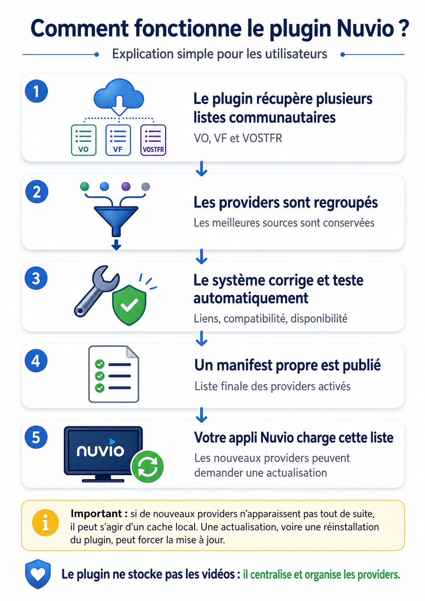

<div align="center">
  

# Nuvio Community Providers

**Un manifest communautaire unifié pour Nuvio — VO, VF et VOSTFR.**

[](manifest.json)
[](#)
[](manifest.json)
[](package.json)
[](LICENSE)
[](https://github.com/niakw/niakw-nuvio-providers-group-1-0/actions/workflows/sync.yml)
</div>

---

## 🔗 Liens des manifests

### Manifest général — recommandé

**VF + VOSTFR + VO + autres langues**

```text
https://raw.githubusercontent.com/niakw/niakw-nuvio-providers-group-1-0/refs/heads/main/manifest.json
```

[Ouvrir le manifest général](https://raw.githubusercontent.com/niakw/niakw-nuvio-providers-group-1-0/refs/heads/main/manifest.json)

### Manifest francophone

**Sélection dédiée aux providers francophones, avec leur état actif ou désactivé conservé.**

```text
https://raw.githubusercontent.com/niakw/niakw-nuvio-providers-group-1-0/refs/heads/main/vf/manifest.json
```

[Ouvrir le manifest francophone](https://raw.githubusercontent.com/niakw/niakw-nuvio-providers-group-1-0/refs/heads/main/vf/manifest.json)

> Dans Nuvio, ajoutez l’une de ces URL dans la section **Plugins / Providers**.

---

## Installation en 30 secondes

1. Copiez l’URL du manifest souhaité ci-dessus.
2. Ouvrez **Nuvio**.
3. Allez dans **Plugins / Providers**.
4. Ajoutez ou importez l’URL.
5. Validez, puis rechargez la liste des providers.

> **Les nouveaux providers n’apparaissent pas ?** Nuvio peut conserver une ancienne liste en cache. Actualisez le plugin ou retirez-le puis ajoutez-le de nouveau.

---

## À quoi sert ce plugin ?

Le projet réunit plusieurs manifests communautaires, regroupe les doublons, conserve les meilleures variantes disponibles, applique des corrections techniques génériques et publie une liste propre pour Nuvio.

<div align="center">
  
</div>

### En résumé

```text
Manifests communautaires
        ↓
Regroupement des providers
        ↓
Corrections et tests automatiques
        ↓
Publication d’un manifest unifié
        ↓
Chargement dans Nuvio
```

**Le plugin ne stocke aucune vidéo.** Il centralise et organise uniquement des providers tiers.

---

## État actuel

| Information | Valeur |
|---|---:|
| Version du manifest | `5.19.0` |
| Providers recensés | `85` |
| Providers activés | `58` |
| Providers désactivés mais conservés | `27` |
| Manifest francophone | `22` providers, dont `20` actifs |
| Validation de publication | `deep` |
| Runtime requis pour le dépôt | Node.js `>= 24` |
| Licence du projet | `GPL-3.0-only` |

Les providers désactivés restent visibles dans les manifests pour préserver la transparence et permettre leur réactivation lors d’une future validation réussie.

---

## Comment fonctionne la validation ?

Lors d’un contrôle **deep**, le dépôt :

- récupère les providers publiés par plusieurs projets communautaires ;
- exclut les protocoles torrent, magnet et P2P ;
- applique les corrections d’URL et adaptations génériques connues ;
- exécute les candidats dans un environnement isolé ;
- vérifie leur chargement, leur accès réseau et les streams retournés lorsqu’ils existent ;
- compare les variantes d’un même provider ;
- publie les fichiers JavaScript avant le manifest qui les référence ;
- conserve les providers indisponibles avec `enabled: false` au lieu de les supprimer.

Les contrôles rapides du code restent informatifs. En parallèle, un workflow léger rafraîchit quotidiennement les adresses depuis les hubs officiels, les annonces Telegram publiques et l’historique du dernier domaine valide. Une recherche publique bornée n’est utilisée qu’en secours et une adresse trouvée uniquement par recherche doit être confirmée lors de deux exécutions consécutives.

Chaque dépôt amont possède deux générations de sauvegarde. Si une source disparaît, renvoie un manifest incomplet ou un fichier corrompu, le système reprend la dernière sauvegarde saine ; les providers déjà publiés restent le dernier repli fonctionnel. Seule une validation `deep` peut promouvoir du nouveau code provider.

---

## Projets communautaires regroupés

Ce dépôt ajoute une couche de regroupement, de contrôle et de maintenance autour de plusieurs projets amont :

- [Gowaru — gowaru-nuvio-providers](https://github.com/Gowaru/gowaru-nuvio-providers)
- [yoruix — nuvio-providers](https://github.com/yoruix/nuvio-providers)
- [NuvioPlugin — All-in-One-Nuvio](https://github.com/NuvioPlugin/All-in-One-Nuvio)

Les crédits détaillés sont disponibles dans [`THIRD_PARTY_NOTICES.md`](THIRD_PARTY_NOTICES.md) et [`NOTICE`](NOTICE).

> Ce projet n’est pas officiel et n’est affilié ni à Nuvio, ni aux mainteneurs des dépôts amont.

---

## Transparence du projet

<div align="center">
  
  &nbsp;&nbsp;&nbsp;&nbsp;
  
</div>

Ce dépôt a été développé et maintenu dans une démarche de **vibe coding assisté par IA**, avec vérifications automatisées, tests reproductibles et historique public des modifications.

Mainteneur : **[niakw](https://github.com/niakw)**

---

## Utilisation responsable

Utilisez uniquement des sources et contenus auxquels vous êtes autorisé à accéder. Les contrôles automatisés vérifient des éléments techniques ; ils ne déterminent pas le statut juridique d’un contenu ni l’autorisation de le consulter.

Le projet ne fournit, n’héberge, ne stocke, ne met en cache et ne distribue aucun contenu audiovisuel, compte, abonnement, identifiant ou fichier média.

Documentation complémentaire :

- [`INSTALL.md`](INSTALL.md)
- [`HEALTH-CHECK.md`](HEALTH-CHECK.md)
- [`VALIDATION.md`](VALIDATION.md)
- [`SECURITY.md`](SECURITY.md)
- [`DISCLAIMER.md`](DISCLAIMER.md)
- [`CHANGELOG.md`](CHANGELOG.md)

---

<div align="center">
  <strong>Communautaire • Automatisé • Transparent</strong>
</div>
