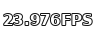
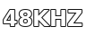
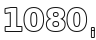

# NiakVIO StreamBadges — guide technique et cinéphile

[English](../stream-badges-technical-guide.md) · [Installer les StreamBadges](how-to-add-stream-badges.md) · [Retour au README](../../README.fr.md)

Les StreamBadges NiakVIO ne sont pas une note de qualité. Ils constituent un vocabulaire compact de **faits techniques sur un flux** : source, résolution, mode de livraison, conteneur, codec vidéo, HDR, framerate, bitrate, audio, langues, sous-titres et classification.

> **Règle :** afficher ce qui est connu, laisser inconnu ce qui ne l'est pas. Un badge `HLS` vrai vaut mieux qu'un faux `1080p`, `HEVC` ou `HDR`.

Feed stable actuel : `assets/stream-badges-fusion-v4.json` — **301 badges / 16 groupes**.

## Lire un flux comme une fiche média

Exemple :

`AVC · 1920×1080 · 6,0 Mbps · 23,976 fps · AAC · Stéréo · 48 kHz · Coréen`

| Donnée | Ce qu'elle signifie |
| --- | --- |
| AVC / H.264 | Codec vidéo extrêmement répandu. À qualité visuelle comparable, il demande généralement plus de bitrate que HEVC ou AV1. |
| 1920×1080 | Full HD / 1080p. Cela ne dit **pas** si la source est Blu-ray ou WEB-DL. |
| 6,0 Mbps | Débit vidéo plausible pour un encode streaming 1080p, mais pas une note de qualité. |
| 23,976 fps | Cadence cinéma/anime très courante dérivée du 24 fps. |
| AAC | Codec audio avec pertes très répandu en streaming. |
| Stéréo / 2.0 | Deux canaux audio. |
| 48 kHz | Fréquence d'échantillonnage standard en film, TV et anime. |
| Coréen | Langue audio normalisée vers le badge universel `KO`. |

       

## Source ≠ résolution ≠ livraison ≠ conteneur

Ces quatre familles décrivent des choses différentes.

### Source / provenance

| Famille | Signification pratique |
| --- | --- |
| WEB-DL | Livraison directe issue d'un service web, généralement sans étape de recapture vidéo. |
| WEBRip | Capture ou réencodage depuis une source web ; qualité très variable. |
| Blu-ray / BDMV | Source ou structure issue d'un disque Blu-ray. |
| BD REMUX / UHD REMUX | Pistes du disque repackagées sans réencoder l'essence vidéo/audio. Fichiers généralement volumineux. |
| UHD Blu-ray | Source disque Ultra HD, fréquemment 2160p avec vidéo compatible HDR. |
| HDTV | Source issue d'une diffusion TV. |
| DVD / DVD Rip | Source optique SD. |
| CAM / TS / TC | Provenance de capture cinéma. Information utile, pas label de qualité. |

    

### Résolution et mode de balayage

Les classes courantes vont de 240p à 8K/4320p et incluent **1080i**.

- **1080p** = Full HD progressif.
- **1080i** = Full HD entrelacé, encore rencontré dans des sources TV/broadcast.
- Un film recadré peut ne pas mesurer exactement 1920×1080 tout en appartenant à la classe 1080p.
- La résolution seule ne renseigne ni la source, ni l'efficacité du codec, ni les artefacts de compression.

    

### Livraison et conteneur

**HLS** et **MPEG-DASH** décrivent une livraison HTTP adaptative. **MKV, MP4, WebM, MPEG-TS et M2TS** sont des conteneurs/formats de fichier.

| Badge | Signification |
| --- | --- |
| HLS / M3U8 | Streaming HTTP adaptatif. Un master peut annoncer plusieurs variantes, codecs et pistes de langue. |
| MPEG-DASH / MPD | Livraison HTTP adaptative fondée sur un manifest MPD. |
| MKV / Matroska | Conteneur souple très courant pour Blu-ray/anime et pistes multiples. |
| MP4 | Conteneur extrêmement compatible. |
| MPEG-TS / M2TS | Familles de transport streams courantes en broadcast, segments HLS et structures Blu-ray. |

   

Un provider peut légitimement n'afficher que **HLS** si l'URL `.m3u8` est prouvée mais qu'aucune qualité/codec fiable n'est disponible.

## Codecs vidéo

| Codec | Usage courant | À retenir |
| --- | --- | --- |
| AVC / H.264 | Blu-ray et streaming très répandu | Très compatible ; moins efficace que HEVC/AV1 à qualité comparable. |
| HEVC / H.265 | UHD Blu-ray, 4K streaming, anime 10-bit | Efficace ; très courant avec HDR et 10-bit. |
| AV1 | Streaming moderne | Très efficace ; support matériel plus récent. |
| VP9 | Streaming web | Codec web important, historiquement très utilisé par Google. |
| MPEG-2 / VC-1 / MPEG-4 Part 2 | Diffusions/disques/encodes plus anciens | Information utile de compatibilité et de provenance. |

   

**x264/x265 sont des encodeurs** ; AVC/H.264 et HEVC/H.265 sont les standards de codec. NiakVIO normalise les alias vers le bon fait technique.

## Bit depth, HDR et formats de présentation

NiakVIO distingue 8-bit, 10-bit et 12-bit de la plage dynamique.

- **10-bit ne signifie pas automatiquement HDR.** Beaucoup d'encodes anime de qualité sont 10-bit SDR.
- La famille HDR couvre SDR, HDR générique, HDR10, HDR10+, Dolby Vision et HLG.
- IMAX, IMAX Enhanced et 3D sont des informations séparées.

   

## Framerate

Valeurs normalisées : 23,976, 24, 25, 29,97, 30, 50, 59,94 et 60 fps.

- 23,976/24 fps domine le cinéma et beaucoup d'anime.
- 25/50 fps est fréquent dans les environnements broadcast dérivés du PAL.
- 29,97/59,94 dérive du timing NTSC.
- Plus de fps ne signifie pas automatiquement « meilleur » ou « plus cinéma ».

## Bitrate

NiakVIO conserve **la valeur exacte** dans la description technique et utilise le badge générique BITRATE uniquement pour signaler que la mesure existe.

Ordres de grandeur indicatifs :

| Livraison | Valeurs souvent rencontrées |
| --- | --- |
| 1080p H.264 streaming | ~3–10 Mbps |
| 1080p HEVC streaming | ~1,5–6 Mbps |
| Blu-ray AVC | souvent ~15–35+ Mbps |
| 4K HEVC streaming | souvent ~10–25 Mbps |
| UHD Blu-ray | fréquemment plusieurs dizaines de Mbps, parfois davantage |

Ce ne sont pas des seuils de qualité. 6 Mbps en AVC et 6 Mbps en AV1 ne sont pas équivalents : source, codec, réglages encodeur, grain et mouvement comptent.

## Audio : codec, technologie, canaux et fréquence

NiakVIO garde ces faits séparés.

- codecs : AAC, AC-3, E-AC-3, TrueHD, DTS/DTS-HD, FLAC, PCM/LPCM, Opus, MP3, ALAC ;
- technologies : Dolby Atmos, DTS:X ;
- canaux : 1.0, 2.0, 2.1, 5.1, 7.1 ;
- fréquences : 44,1, 48, 88,2, 96 et 192 kHz.

    

48 kHz est la base normale pour film/TV/vidéo. 96 ou 192 kHz ne prouve pas à lui seul une meilleure qualité audible.

## Langues et sous-titres

Les badges publics utilisent un modèle ISO/BCP-47 : `FR`, `FR-CA`, `EN`, `KO`, `JA`, `PT-BR`, `ES-419`, `ZH-HK`, `ZH-TW`, etc.

Les termes historiques `VF`, `VFF`, `VFQ`, `VO`, `MULTI` et `VOSTFR` restent uniquement des **alias d'entrée**.

- VF/VFF peuvent être normalisés vers un audio français lorsque la preuve le permet.
- VFQ peut être normalisé vers français Canada.
- VOSTFR devient audio original + sous-titres français lorsque la langue originale est connue.
- **VO ne devient jamais automatiquement anglais.**

## Classifications : les pays n'utilisent pas le même système

NiakVIO conserve le système régional lorsqu'il est connu : MPA/TV US, Corée ALL/12/15/19, FSK allemand, Japon G/PG12/R15+/R18+, CBFC indien, Brésil, Québec, Espagne, France, Hong Kong, Finlande, Grèce, Portugal, Philippines, Indonésie, Russie, Pologne, Suède, Taïwan et LATAM.

Un badge numérique générique est utilisé lorsque le seul fait fiable est un âge minimal.

## Que mettre dans le titre du flux ?

Le titre reste volontairement simple : **identité provider + meilleure qualité réellement prouvée**.

Exemples :

- 1080p prouvé → `Kehflix - 1080p`
- 1080i prouvé → `Kehflix - 1080i`
- 2160p prouvé → `Kehflix - 4K`
- 4320p prouvé → `Kehflix - 8K`
- `Unknown`, `Inconnue`, `N/A`, `Auto` → simplement `Kehflix`

Les autres informations vont dans les badges et la description. Si un flux Kehflix pauvre en métadonnées ne prouve qu'une URL `.m3u8`, la présentation correcte est **Kehflix + HLS**, jamais « Kehflix - Inconnue » et jamais une résolution devinée.

## Comment NiakVIO décide d'afficher un badge

1. le provider retourne les faits bruts disponibles ;
2. le Core conserve et normalise les preuves les plus fortes ;
3. la présentation émet des `badgeIds` structurés et une description technique lisible ;
4. les règles StreamBadge de Nuvio matchent ces faits ;
5. une information absente reste absente.

Cette séparation évite « l'inflation de badges » et rend réellement les données utiles aux utilisateurs qui s'intéressent à la qualité média.

## Version des feeds

Toute modification matérielle crée une nouvelle version immuable des **quatre** feeds publics.

Version actuelle :

- `assets/stream-badges-fusion-v4.json`
- `assets/stream-badges-dark-v4.json`
- `assets/stream-badges-light-v4.json`
- `assets/stream-badges-transparent-v4.json`

Les anciennes versions restent disponibles pour les installations épinglées.
